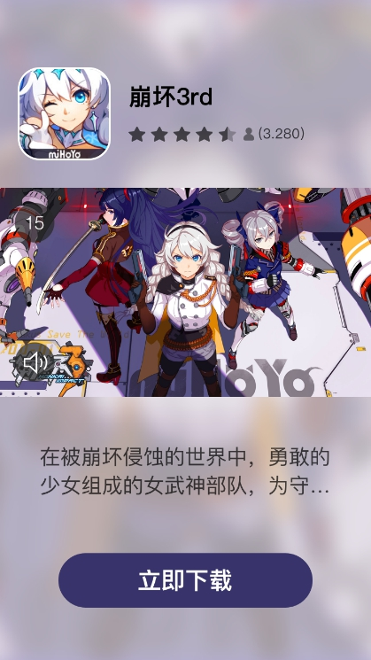

- [Mintegral Adx对接文档](#mintegral-adx对接文档)
  * [nurl和展示监测链接说明](#nURL-and-Impression-Tracking-URLs)
    + [展示监测链接返回说明](#About-impression-tracking-URL)
  * [nURL Macro Substitution](#nURL-Macro-Substitution)
  * [About Billing](#About-Billing)
  * [About COPPA](#About-COPPA)
  * [Supported Advertisement Types](#Supported-Advertisement-Types)
  * [About Video Template (optional)](#About-Video-Template-optional)
    + [What is Video Template](#What-is-Video-Template)
  * [How to Use Video Template](#How-to-Use-Video-Template)
    + [Video Template and Required Creatives](#Video-Template-and-Required-Creatives)
  * [About VAST](#About-VAST)
  * [Request-Demo](#Request-Demo)
    + [Rewarded Video & Interstitial Video Request](#rewarded-video--interstitial-video-request)
    + [Native image Request](#native-image-request)
    + [Native video Request](#native-video-request)
  * [Response Demo](#Response-Demo)
    + [Rewarded | Interstitial Video Reponse](#rewarded--interstitial-video-reponse)
    + [Native image Response](#native-image-response)
    + [Native video Response](#native-video-response)
  * [Request Specification](#Request-Specification)
    + [Object：BidRequest](#objectbidrequest)
    + [Object：Imp](#object-imp)
    + [Object: Banner](#object-banner)
    + [Object: Video](#object-video)
  * [Object: Native](#object-native)
  * [Object: NativeRequest](#object-nativerequest)
  * [Object: Asset](#object-asset)
  * [Object: Title](#object-title)
  * [Object: Img](#object-img)
  * [Object: Data](#object-data)
  * [Native Request Type 枚举值](#native-request-type-枚举值)
  * [Object: App](#object-app)
  * [Object: Publisher](#object-publisher)
  * [Object: Device](#object-device)
  * [Object: Geo](#object-geo)
  * [Object: Regs](#object-regs)
- [返回接口说明](#返回接口说明)
  * [Object: BidResponse](#object-bidresponse)
  * [Object: Seatbid](#object-seatbid)
  * [Object: Bid](#object-bid)
  * [Object: Ext](#object-ext)
  * [Object: NativeResponse](#object-nativeresponse)
  * [Object: Asset](#object-asset-1)
    + [Object: Asset.Title](#object-assettitle)
    + [Object: Asset.Img](#object-assetimg)
    + [Object: Asset.Video](#object-assetvideo)
    + [Object: Asset.Data](#object-assetdata)
    + [Object: Asset.Link](#object-assetlink)
- [No bidding 说明](#no-bidding-说明)


# Mintegral Adx对接文档

## nURL and Impression Tracking URLs

DSPs will provide the nURLs and the impression tracking URLs in the bidResponse, whereas impression tracking URLs are optional.
MTG ADX will call back both the nURL and the impression tracking URL when an Ad is displayed on the client device. 

### About impression tracking URL

To reduce variance in the impression statistic, it is suggested to provide an individual tracking URL for each Ad type and each DSP.

For different ad types, DSP should follow the rules below to submit impression tracking URLs.
1) Interactive ads and Banner: The impression tracking URL is provided in the filed **Bidresponse.Seatbid.Bid.Ext.Imptrakers**
2) Native image and Native video: The impression tracking URL is provided in the field **imptrakers** of the Native Ads protocol. 
3) Rewarded video and Interstitial video ad formats: The impression tracking URL is provided in the \<impression>tag of VAST.

## nURL Macro Substitution

MTG ADX support the following macro substitution.

| Name | Description | Note |
|---|---|---|
|${AUCTION_ID}     |	Bid Request ID  |	The request.id from MTG ADX to DSP |
|${AUCTION_BID_ID} | Bid Response ID	| The response BidResponse.BidID from DSP to MTG ADX |
|${AUCTION_IMP_ID} | Impression ID    |	The response Bid.ImpId from DSP|
|${AUCTION_SEAT_ID}| Seat ID          |	The response BidResponse.SeatBid.Seat from DSP|
|${AUCTION_AD_ID}	 | Advertisement ID | The Ad ID Bid.Adid|
|${AUCTION_PRICE}	 | Settlement Price |	Encrypted settlement price, for more details please refer to the settlement price decryption section|


## About Billing 

MTG ADX bills DSPs based on the callback times of the nURLs.

MTG ADX will guarantee **at most once** callback on the nURL each time an Ad is displayed；

Meanwhile, MTG ADX will also ensure the callback of the nURL will happen within a valid period after the demonstration of the Ad.

DSP can set the timeout of this period in the field Bidresponse.Seatbid.Bid.Exp.

## About COPPA

If the value of bidrequest.regs.coppa is 1, it means that this Ad flow is targeted at children under the age of 13, or a child-oriented App.

In this case, the DSP must guarantee the provided Ads are appropriate for children under the age of 13. 

Meanwhile, the DSP must ensure data collection, data usage and data tracking comply with the COPPA regulations.

## Supported Advertisement Types

MTG ADX supports the following types of advertisement：

* Rewarded Video
* Interstitial Video
* Native Video
* Native Image

## About Video Template (optional)

Rewarded video and Interstitial video support multiple video templates，DSP can compare and choose one or more of them to use. However, this is fully optional. 

### What is Video Template

Video templates are multiple predefined video playing modes, DSPs can choose the optimal template to serve ads.

MTG ADX supports the following video templates：

|Image|Description|
|---|----|
||V1 Video centered with black background|
||V2 Video centered with Gaussian Blur|
||V3 Video on top with info-card at bottom|
||V4 Video on top with storekit at bottom|
||V8 Video in the middle of two info-cards|


## How to Use Video Template

1. Request: If a DSP wants to use video template, MTG ADX will send in the bidrequest with the field bidrequest.imp.video.ext.videotemplate set, which is an array of objects and each object represents a type of video template.
The structure of a Video Template object:
**When video templates are in use, the width and height requirement of the video template object are applied, instead of the width and height requirement of the video object**

| Attribute	| Type	| Required | Description |
|---|---|---|---|
|id |	integer	|Yes	| Template id|
|name	 |String|	Yes| 	Template name|
|videow	 |integer| The videow/ videoh pair or the videoorientaion will be presented |	Width of the video player in device independent pixels (DIPS).|
|videoh	 |integer|	The videow/ videoh pair or the videoorientaion will be presented| Height of the video player in device independent pixels (DIPS).|
|videoorientation	 |integer|The videow/ videoh pair or the videoorientaion will be presented	|Orientation of video. Enumeration value is as below: 1="portrait",2="horizontal". 1 represents DSP can return video with a ratio of 16:9, 2 represents DSP can return video with a ratio of 16:9 or 9:16.|

2. Response: DSP returns the ID of the chosen video template, as well as the creative elements required for the video template.

  DSP should add a \<Template type="video"> tag under the \<Extension> tag in VAST, and provide the ID of the chosen vide template. 
  
  Assets except video, title and desc should be provided under \<Asset> tags.

  Please note that videos should always be provided as linear creative, and title should be provided in a \<Title> tag, and description in a \<description>tag.
  ```xml
<Extensions>
  <Extension>
      <Templates type="video" ></Templates>
      <Asset type="starrating" >4.5</Asset>
      <Asset type="CTA" >Install</Asset>
      <Asset type="icon" creativeType="image/jpeg">
        <![CDATA[http://cdn-adn.rayjump.com/cdn-adn/v2/dmp/18/12/25/00/13/5c2105bc9869e.jpg]]>
      </Asset>
  </Extension>
</Extensions>
  ```

### Video Template and Required Creatives

“/” Not Required

|id|	Name|	title |	Description | icon |CTA |	star rating |	bundle id |
|---|---|---|---|---|---|---|---|
|1|	V1 Video centered with black background	|/|	/|	/|	/|	/|	/|
|2|	V2 Video centered with Gaussian Blur	|/|	/|	/|	/|	/|	/|
|3|	V3 Video on top with info-card at bottom	|15 characters max | /	|w/h ratio of 1:1| 5 characters max (optional)|	optional | / |
|4|	V4 Video on top with storekit at bottom |/|/| 	/|	/|	/|	ios example: 907394059 |
|8|	V8 Video in the middle of two info-cards|	15 characters max|	30 characters max|	w/h ratio of 1:1|	5 characters max	| optional |/ |


## About VAST

VAST version is specified by Bidrequest.Imp.Video.Protocols. Currently MTG ADX supports VAST 3.0.
All links in VAST should be wrapped in CDATA.

## Request Demo

### Rewarded Video & Interstitial Video Request
```json
{
    "id": "fb570d84-0328-451f-9c19-f4cad4ed0e30",
    "app": {
        "id": "92762",
        "ver": "8.0.5",
        "bundle": "test.mtg.cn",
        "publisher": {
            "id": "12441"
        },
        "storeurl": "https://play.google.com/store/apps/details?id=test.mtg.cn"
    },
    "at": 2,
    "tmax": 2000,
    "imp": [
        {
            "id": "1",
            "video": {
                "mimes": [
                    "video/mp4"
                ],
                "maxduration": 30,
                "protocols": [
                    2
                ],
                "w": 1080,
                "h": 1920,
                "linearity": 1,
                "skip": 0,
                "battr": [
                    16
                ],
                "maxbitrate": 2000,
                "delivery": [
                    2
                ],
                "companionad": [
                    {
                        "w": 1080,
                        "h": 1920,
                        "id": "1",
                        "btype": [
                            1,
                            2,
                            4
                        ],
                        "battr": [

                        ],    
                        "pos": 7,
                        "mimes": [
                            "application/javascript"
                        ],
                        "ext": {
                            "orientation": 1
                        }
                    }
                ],
                "companiontype": [
                    2
                ],
                "ext": {
                    "orientation": 1,
                    "videotype": 1,
                    "videotemplate": [
                        {
                            "id": 1,
                            "name": "middle_black_screen",
                            "videow": 1080,
                            "videoh": 1920,
                            "videoorientation": 1
                        },
                        {
                            "id": 2,
                            "name": "middle_fur_screen",
                            "videow": 1080,
                            "videoh": 1920,
                            "videoorientation": 1
                        },
                        {
                            "id": 6,
                            "name": "stretch_screen",
                            "videow": 1080,
                            "videoh": 1920,
                            "videoorientation": 1
                        },
                        {
                            "id": 3,
                            "name": "above_video",
                            "videoorientation": 2
                        },
                        {
                            "id": 5,
                            "name": "image_video",
                            "videoorientation": 2
                        }
                    ],
                    "videoendtype": [
                        1
                    ],
                    "endcardonly": true
                }
            },
            "tagid": "21310",
            "bidfloor": 0.01,
            "bidfloorcur": "USD",
            "secure": 0
        }
    ],
    "device": {
        "ua": "Mozilla/5.0 (Linux; Android 6.0.1; SM-G610F Build/MMB29K) AppleWebKit/535.19 (KHTML, like Gecko) Chrome/18.0.1025.133 Mobile Safari/535.19",
        "geo": {
            "country": "IND",
            "city": "Goa"
        },
        "ip": "106.213.155.0",
        "devicetype": 4,
        "make": "samsung",
        "model": "sm-g610f",
        "os": "android",
        "osv": "6.0.1",
        "language": "zh",
        "carrier": "45201",
        "connectiontype": 2,
        "ifa": "eebb9c88-bbd3-49bc-87cc-cb6babdf1ea4",
        "didsha1": "1ad2308597ee8b54c21de2d15a095cb7b322db12",
        "didmd5": "69a975be6d1f9ce3604d99a2fe794ab0",
        "dpidsha1": "747417f2206148a3118d02f3adf20b5e4139baac",
        "dpidmd5": "fa1d3eb08a879de9a4cd9995a1aa91e1",
        "imei": "863183034027383",
        "android_id": "1111111111111111",
        "dnt": 0,
        "lmt": 0
    }
}
```

### Native image Request
```json
{
    "id": "5c7f8c1031f73b6b3ed5b7fx",
    "imp": [{
      "id": "1",
      "native": {
        "request": "{\"ver\":\"1.1\",\"assets\":[{\"id\":7,\"required\":1,\"img\":{\"type\":3,\"w\":1200,\"h\":627}},{\"id\":3,\"required\":1,\"title\":{\"len\":20}},{\"id\":4,\"required\":1,\"data\":{\"type\":2}}]}",
        "ver": "1.1"
    },
    "tagid": "14915",
    "bidfloor": 0.1,
    "bidfloorcur": "USD",
    "secure":1
    }],
    "app": {
      "id": "25259",
      "cat": ["IAB9", "IAB1"],
      "ver": "9.5.1",
      "bundle": "id443354861",
      "publisher": {
        "id": "5095"
      },
      "storeurl": "https://itunes.apple.com/cn/app/%E7%9B%B8%E6%9C%BA360-%E8%87%AA%E6%8B%8D%E8%BE%BE%E4%BA%BA%E5%BF%85%E5%A4%87%E7%9A%84%E7%BE%8E%E9%A2%9C%E7%A5%9E%E5%99%A8/id443354861?mt=8"
  },
  "device": {
      "ua": "Mozilla/5.0 (iPhone; CPU iPhone OS 12_1_4 like Mac OS X) AppleWebKit/605.1.15 (KHTML, like Gecko) Mobile/16D57",
      "geo": {
        "country": "THA",
        "city": "175249"
      },
      "dnt": 0,
      "ip": "223.207.218.75",
      "devicetype": 4,
      "make": "apple",
      "model": "iphone xr",
      "os": "ios",
      "osv": "12.1.4",
      "language": "th",
      "carrier": "52005",
      "connectiontype": 2,
      "ifa": "6273CA83-ACD0-4898-BC56-F143E53AC936"
    },
    "at": 2,
    "tmax": 2000
}
```

### Native video Request
```json
{
      "id": "Android_native_video",
      "imp": [
              {
                      "id": "1",
                      "native": {
                              "request": "{\"ver\":\"1.1\",\"assets\":[{\"id\":7,\"required\":1,\"img\":{\"type\":3,\"w\":1200,\"h\":627}},{\"id\":1,\"required\":1,\"img\":{\"type\":1,\"w\":300,\"h\":300}},{\"id\":3,\"required\":1,\"title\":{\"len\":20}},{\"id\":4,\"required\":1,\"data\":{\"type\":2}},{\"id\":5,\"required\":1,\"data\":{\"type\":3}},{\"id\":6,\"required\":1,\"data\":{\"type\":12}},{\"id\":2,\"required\":1,\"video\":{\"mimes\":[\"video/mp4\"],\"w\":0,\"h\":0,\"ext\":{\"orientation\":2}}}]}",
                              "ver": "1.1"
                      },
                      "tagid": "21307",
                      "bidfloor": 0.01,
                      "bidfloorcur": "USD",
                      "secure": 0,
                      "support_download": false,
                      "request_type": 7
                      
              }
      ],
      "app": {
              "id": "92762",
              "ver": "8.0.5",
              "bundle": "test.mtg.cn",
              "publisher": {
                      "id": "12441"
              },
              "storeurl": "https://play.google.com/store/apps/details?id=test.mtg.cn"
      },
      "device": {
              "ua": "Mozilla/5.0 (Linux; Android 6.0.1; SM-G610F Build/MMB29K) AppleWebKit/535.19 (KHTML, like Gecko) Chrome/18.0.1025.133 Mobile Safari/535.19",
              "geo": {
                      "country": "SGP",
                      "city": "2222"
              },
              "dnt": 0,
              "ip": "123.125.71.38",
              "devicetype": 4,
              "make": "samsung",
              "model": "sm-g610f",
              "os": "android",
              "osv": "6.0.1",
              "language": "en",
              "carrier": "45201",
              "connectiontype": 2,
              "ifa": "eebb9c88-bbd3-49bc-87cc-cb6babdf1ea4",
              "didsha1": "dec639f355b425e4d425e628eed8638244a93e6a",
              "didmd5": "bb75882f511f906d109f8831ec780ae7",
              "imei": "354124073790693"
      },
      "at": 2,
      "tmax": 2000
}
```

## Response Demo

### Rewarded | Interstitial Video Reponse
```json
{
  "id":"1b26b039-7c0d-4c8b-94b3-15cb60c27da1",
  "seatbid":[
      {
          "bid":[
              {
                  "id":"10004-1673e175-f942-4e6b-9985-2b9e2227375e",
                  "impid":"1",
                  "price":1153.4,
                  "adid":"512205",
                  "adm":"<?xml version=\"1.0\" encoding=\"UTF-8\"?><VAST version=\"2.0\"><Ad id=\"08f0ade0-0844-11e9-9857-0242e01c4a20\"><InLine><AdSystem>mobvista</AdSystem><AdTitle>cs_video3</AdTitle><Impression id=\"0\"><![CDATA[http://a.com/winloss/Imps?impId=32f9293]]></Impression><Creatives><Creative id=\"55\" sequence=\"1\"><Linear><Duration>00:00:27</Duration><TrackingEvents><Tracking event=\"start\"><![CDATA[start]]></Tracking><Tracking event=\"start\"><![CDATA[http://a.com/winloss/Clicks?crId168.16.7:6688;redir=1]]></Tracking><Tracking event=\"firstQuartile\"><![CDATA[firstQuartile]]></Tracking><Tracking event=\"firstQuartile\"><![CDATA[http://a.com/winloss/Clicks?crId=5.16.7:6688;redir=1]]></Tracking><Tracking event=\"midpoint\"><![CDATA[midpoint]]></Tracking><Tracking event=\"midpoint\"><![CDATA[http://a.com/winloss/Clicks?crId168.16.7:6688;redir=1]]></Tracking><Tracking event=\"thirdQuartile\"><![CDATA[thirdQuartile]]></Tracking><Tracking event=\"thirdQuartile\"><![CDATA[http://a.com/winloss/Clicks?crId=.168.16.7:6688;redir=1]]></Tracking><Tracking event=\"complete\"><![CDATA[complete]]></Tracking><Tracking event=\"complete\"><![CDATA[http://a.com/winloss/Clicks?crId=5:6688;redir=1]]></Tracking><Tracking event=\"mute\"><![CDATA[mute]]></Tracking><Tracking event=\"mute\"><![CDATA[http://a.com/winloss/Clicks?crId=68.16.7:6688;redir=1]]></Tracking><Tracking event=\"unmute\"><![CDATA[unmute]]></Tracking><Tracking event=\"unmute\"><![CDATA[http://a.com/winloss/Clicks?crId=55168.16.7:6688;redir=1]]></Tracking><Tracking event=\"pause\"><![CDATA[pause]]></Tracking><Tracking event=\"pause\"><![CDATA[http://a.com/winloss/Clicks?crId=55;sId=72.16.7:6688;redir=1]]></Tracking><Tracking event=\"fullscreen\"><![CDATA[fullscreen]]></Tracking><Tracking event=\"fullscreen\"><![CDATA[http://a.com/winloss/Clicks?crId.16.7:6688;redir=1]]></Tracking></TrackingEvents><VideoClicks><ClickThrough><![CDATA[http://a.com/winloss/Clicks?crId=55]]></ClickThrough></VideoClicks><MediaFiles><MediaFile delivery=\"progressive\" type=\"video/mp4\" bitrate=\"446\" width=\"720\" height=\"1280\" scalable=\"false\" apiFramework=\"NONE\"><![CDATA[http://a.com/creativeFiles/d/7/9F1DB6B6853412.mp4]]></MediaFile></MediaFiles></Linear></Creative></Creatives></InLine></Ad></VAST>",
                  "nurl":"http://a.com/n?price=${AUCTION_PRICE}",
                  "iurl":"http://b.com/4",
                  "cat":[
                      "IAB12-2"
                  ],
                  "qagmediarating":1,
                  "ext":{
                      "videoendtype":1,
                      "endcardonly":true
                  }
              }
          ]
      }
  ],
  "bidid":"10004-1673e175-f942-4e6b-9985-2b9e2227375e"
}
```

### Native image Response

```json
{
    "id": "1a48f7e5-2a31-4907-90db-dbe9dd5c0ad0",
    "seatbid": [{
      "bid": [{
        "id": "712107b0-0840-11e9-9857-0242e01c4a20",
        "impid": "1",
        "price": 2.3,
        "adid": "57",
        "adm": "{\"native\":{\"link\":{\"url\":\"http://a.com/winloss/Clicks\"},\"imptrackers\":[\"http://a.com/winloss/Imps?impId56\"],\"assets\":[{\"id\":7,\"img\":{\"url\":\"http://a.com/creativeFiles/e/8/92FB12A.jpg\",\"h\":627,\"w\":1200}},{\"id\":1,\"img\":{\"url\":\"http://a.com/creativeFiles/c/5/8EAF929C94AD494F8E2B56E84262A580.png\",\"h\":128,\"w\":128}},{\"id\":3,\"title\":{\"text\":\"Text\"}},{\"id\":4,\"data\":{\"value\":\"Description\"}},{\"id\":6,\"data\":{\"value\":\"Description\"}}]}}",
        "adomain": ["http://www.baidu.com"],
        "nurl": "http://a.com/ad0062",
        "iurl": "http://a.com/25F79ADE4F92E3B.mp4",
        "cid": "",
        "crid": "57",
        "cat": ["IAB3-1"],
        "qagmediarating": 1,
        "ext": {
          "videoendtype": 1,
          "endcardonly": true
        }
      }]
    }],
    "cur": "USD"
}
```

### Native video Response
```json
{
    "id": "01652509-dbd5-4ee7-aa63-56dc066cba1d",
    "seatbid": [{
      "bid": [{
        "id": "6c2ac6f0-0841-11e9-9857-0242e01c4a20",
        "impid": "1",
        "price": 2.5,
        "adid": "58",
        "adm": "<?xml version=\"1.0\" encoding=\"UTF-8\"?><VAST version=\"2.0\"><Ad id=\"08f0ade0-0844-11e9-9857-0242e01c4a20\"><InLine><AdSystem>mobvista</AdSystem><AdTitle>cs_video3</AdTitle><Impression id=\"0\"><![CDATA[http://a.com/winloss/Imps?impItimestamp=1545742391293]]></Impression><Creatives><Creative id=\"55\" sequence=\"1\"><Linear><Duration>00:00:27</Duration><TrackingEvents><Tracking event=\"start\"><![CDATA[start]]></Tracking><Tracking event=\"start\"><![CDATA[http://a.com/winloss/Clicks?crId=55;sI1]]></Tracking><Tracking event=\"firstQuartile\"><![CDATA[firstQuartile]]></Tracking><Tracking event=\"firstQuartile\"><![CDATA[http://a.com/winloss/Clicks?crId=;redir=1]]></Tracking><Tracking event=\"midpoint\"><![CDATA[midpoint]]></Tracking><Tracking event=\"midpoint\"><![CDATA[http://a.com/winloss/Clicks?crId=1]]></Tracking><Tracking event=\"thirdQuartile\"><![CDATA[thirdQuartile]]></Tracking><Tracking event=\"thirdQuartile\"><![CDATA[http://a.com/winloss/Clicks?t=1]]></Tracking><Tracking event=\"complete\"><![CDATA[complete]]></Tracking><Tracking event=\"complete\"><![CDATA[http://a.com/winloss/Clicks?crId=1]]></Tracking><Tracking event=\"mute\"><![CDATA[mute]]></Tracking><Tracking event=\"mute\"><![CDATA[http://a.com/winloss/Clicks]]></Tracking><Tracking event=\"unmute\"><![CDATA[unmute]]></Tracking><Tracking event=\"unmute\"><![CDATA[http://a.com/winloss/Clicks1]]></Tracking><Tracking event=\"pause\"><![CDATA[pause]]></Tracking><Tracking event=\"pause\"><![CDATA[http://a.com/winloss/Clicks?crId=55;sId=72;lId=1]]></Tracking><Tracking event=\"fullscreen\"><![CDATA[fullscreen]]></Tracking><Tracking event=\"fullscreen\"><![CDATA[http://a.com/winloss]]></Tracking></TrackingEvents><VideoClicks><ClickThrough><![CDATA[http://a.com/winloss/Clicks?crId=55]]></ClickThrough></VideoClicks><MediaFiles><MediaFile delivery=\"progressive\" type=\"video/mp4\" bitrate=\"446\" width=\"720\" height=\"1280\" scalable=\"false\" apiFramework=\"NONE\"><![CDATA[http://a.com/creativeFiles/d/7/9F1624F9DB6B6853412.mp4]]></MediaFile></MediaFiles></Linear></Creative></Creatives></InLine></Ad></VAST>",
        "adomain": ["http://www.baidu.com"],
        "nurl": "http://a.com/winloss/Wins?price=${AUCTION_PRICE}",
        "iurl": "http://a.com/creativeFiles/0/f/F0C177E4198E2BEAB0891.mp4",
        "cid": "",
        "crid": "58",
        "cat": ["IAB3-1"],
        "qagmediarating": 1,
        "ext": {
          "videoendtype": 1,
          "endcardonly": true
        }
      }]
    }],
    "cur": "USD"
}
```

## Request Specification

Mintegral’s RTB protocols are based on the IAB’s Open RTB API Specification Version 2.5 with extra attributes from Mintegral ADX. 

Standard attributes from IAB open RTB that are not supported by Mintegral ADX are ~~crossed out~~.

### Object：BidRequest

|  Attribute            | Type|           Required|   Description|
|---|---|---|---|
 | id |      string  | Yes| Unique ID of the bid request, provided by MTG ADX.|
 | imp| object array | Yes | An array of one or more impressionobjects, each impressionobject represents the impression offered. For details, pleaae refer to [Object：Imp](#object-imp)|
 | ~~site~~  |     object     |   No    |     site info|
 | app     | object     |   Yes      |   please refer to [Object App](#object-app)|
 | device  | object     |   Yes      |   please refer to [Object Device](#object-device)|
 | ~~user~~| object     |   No|    user info|
 | ~~test~~| integer    |    No|    test mode|
 | at      |   integer    |    Yes|  Auction type, where 1 = First Price, 2 = Second Price Plus.|
 | tmax    |   integer    |    No|    Maximum time in milliseconds the exchange allows for bids to be received including internet latency to avoid timeout. This value supersedes any a priori guidance from the exchange.|
 | ~~wseat~~|   string array|   No|    White list of buyer seats (e.g., advertisers, agencies) allowed to bid on this impression. IDs of seats and knowledge of the buyer’s customers to which they refer must be coordinated between bidders and the exchange a priori. At most, only one of wseat and bseat should be used in the same request. Omission of both implies no seat restrictions.|
 | ~~bseat~~|    string array|   No|    Block list of buyer seats (e.g., advertisers, agencies) restricted from bidding on this impression. IDs of seats and knowledge of the buyer’s customers to which they refer must be coordinated between bidders and the exchange a priori. At most, only one of wseat and bseat should be used in the same request. Omission of both implies no seat restrictions.|
 | ~~allimps~~|   integer     |   No|     Flag to indicate if Exchange can verify that the impressions offered represent all of the impressions available in context (e.g., all on the web page, all video spots such as pre/mid/post roll) to support road-blocking. 0 = no or unknown, 1 = yes, the impressions offered represent all that are available.|
 | ~~cur~~    |   string array|   No|   Array of allowed currencies for bids on this bid request using. ISO-4217 alpha codes. Recommended only if the exchange accepts multiple currencies.|
 | ~~wlang~~  |   string array|   No|   White list of languages for creatives using ISO-639-1-alpha-2. Omission implies no specific restrictions, but buyers would be advised to consider language attribute in the Device and/or Content objects if available.|
 | bcat    | string array  | No    | Blocked advertiser categories using the IAB content categories. Refer to Appendix-Content Categories.|
 | badv    |  string array|  No|   Block list of advertisers by their domains (e.g., “ford.com”).|
 | bapp    |  string array|  No| Block list of applications by their platform\-specific exchange\-independent application identifiers. For example, on Android com.amazon.mShop; on IOS：*907394059* |
 | ~~source~~|  object|   No| A Sorce object (Section 3.2.2) that provides data about the inventory source and which entity makes the final decision.|
 | regs    | object  |  No| A Regs object that specifies any industry, legal, or governmental regulations in force for this request. Refer to [Object Regs](#object-regs) |

### Object: Imp

| Attribute	| Type |	Required	| Description |
| ---|---|---|---|
|id	|string|	Yes| A unique identifier for this impression within the context of the bid request; On Mintegral ADX, one request only sells one impression.|
|~~metric~~	|object array |	No|	An array of Metric object|
|banner	|object Banner	 |Banner流量必传|	Refer to [Object Banner](#object-banner)|
|video	|object	Video |Video 流量必传|	Refer to [Object Video](#object-video)|
|audio	|object	|Audio流量必传|	Object Audio|
|native	|object Native	|Native流量必传|	Refer to [Object Native](#object-native)|
|~~pmp~~	|object	|No|	A Pmp object containing any private marketplace deals in effect for this impression.|
|~~displaymanager~~	|string|	No|	Name of ad mediation partner, SDK technology, or player responsible for rendering ad (typically video or mobile). Used by some ad servers to customize ad code by partner. Recommended for video and/or apps.|
|~~displaymanagerver~~	|string	|No|	Version of ad mediation partner, SDK technology, or player responsible for rendering ad (typically video or mobile). Used by some ad servers to customize ad code by partner. Recommended for video and/or apps.|
|instl	|integer	|No|	1 = the ad is interstitial or full screen, 0 = not interstitial. default 0.|
|tagid	|string	|Yes|Identifier for specific ad placement or ad tag that was used to initiate the auction. This can be useful for debugging of any issues, or for optimization by the buyer.|
|bidfloor|	float	|Yes|Minimum bid for this impression expressed in CPM. default 0.|
|bidfloorcur|	string	|Yes|Currency specified using ISO-4217 alpha codes. This may be different from bid currency returned by bidder if this is allowed by the exchange. default USD|
|secure|	integer	|Yes|	Flag to indicate if the impression requires secure HTTPS URL creative assets and markup, where 0 = non-secure, 1 = secure.|
|~~iframebuster~~| string array | No|	Array of exchange\-specific names of supported iframe busters.|
|~~exp~~|	integer	|No|	Advisory as to the number of seconds that may elapse between the auction and the actual impression.|

### Object: Banner

| Attribute	| Type |	Required	| Description |
| ---|---|---|---|
|format	|object array|	No|	若广告位可兼容多组宽高，则通过该字段列举可兼容的多组宽高|
|w	|integer|	No|	广告位宽度，单位为设备独立像素|
|h	|integer|	No|	广告位高度，单位为设备独立像素|
|id	|string	|Yes|banner 对象的唯一标识；在一个 Ad 中包含 Banner 与 Video 的时候使用|
|btype|	integer array	|No|	限制不可投放的bannerType，枚举值参考附录Banner Ad Types|
|battr|	integer array	|No|	限制不可投放的物料属性，枚举值参考附录Creative Attributes|
|pos|	integer|	No|	广告位置，枚举值参考附录Ad Position|
|mimes|	string array|	Yes|	支持的内容 mime-type；包括但不仅限于“application/javascript”, “image/jpg”, and “image/gif”|
|~~topfram~~|	integer	|No|	banner是在顶层frame中而不是iframe中，0-不是; 1-Yes|
|~~expdir~~|	integer array	|No|	banner可以扩展的方向，参考表附录Expandable Direction|
|api|	integer array	|No|	该次展示可支持的 API 框架；枚举值释义参考附录API Frameworks；该字段缺省表示所有枚举值均不支持|
|~~vcm~~|	integer	|No|	当banner object作为video object的伴随广告时，标识伴随广告的渲染模式；0-concurrent, 1-endcard|

### Object: Video

| Attribute	| Type |	Required	| Description |
|---|---|---|---|
|mimes|	string array|	Yes|支持的内容 mime-type；包括但不仅限于“video/mp4”；|
|minduration	|integer	|No|	最小的视频长度， 以秒为单位；|
|maxduration	|integer	|No|	最大的视频长度， 以秒为单位；|
|protocols	|integer array	|No|	支持的视频竞价响应协议；枚举值参考附录Protocols|
|w|	integer	|Yes|视频播放器的宽度，单位为像素|
|h|	integer	|Yes|视频播放器的高度，单位为像素|
|~~startdelay~~	|integer	|Yes|视频前，中及之后的广告位中视频广告的启动延时，以秒为单位,枚举值参考附录Start Delay|
|~~placement~~	|integer	|Yes|广告位Type；枚举值参考Video Placement Types；|
|linearity	|integer	|Yes|展示是否是线性的，1-线性；2-非线性；|
|skip	|integer	|Yes|传 0 表示不支持用户 skip，传 1 表示支持用户 skip；|
|~~skipmin~~|	integer	|Yes|最小可跳过的广告总时长；超过该时长的广告才支持跳过；|
|~~skipafter~~	|integer	|Yes|广告播放多少秒后可跳过；|
|sequence	|integer	|Yes|如果在同一个竞价请求中提供了多个展示， 则需要考虑多个物料传输的顺序|
|battr	|integer array	|Yes|限制不可投放的物料属性，枚举值参考附录Creative Attributes|
|~~maxextended~~	|integer|	No|	最大的视频广告延长时间长度（如果支持延长）-1：表示允许延时，且没有时间限制空或者0：表示不允许延长大于0：表示可以延长的时间长度比maxduration大的值|
|minbitrate	|integer	|Yes|最小的比特率，以 Kbps 为单位；缺省表示不限制|
|maxbitrate	|integer	|Yes|最大的比特率，以 Kbps 为单位；缺省表示不限制|
|~~boxingallowed~~	|integer|	Yes|是否允许将4：3的内容展示在16：9的窗口， 0表示不允许，1表示允许|
|playbackmethod	|integer array	|No|	允许的播放方式，播放方式和对应的枚举值如下：1: 自动播放（有声）2: 自动播放（静音）3: 点击播放 如果该字段缺省，表示支持全部|
|~~playbackend~~	|integer	|No|	导致视频播放中断的原因；|
|delivery	|integer array	|No|	支持的传输方式，传输方式和对应的枚举值如下：1-Streaming；2-Progressive如果没有指定，表示全部支持|
|~~pos~~	|integer|	No|	广告位置，枚举值参考附录Ad Position|
|companionad	|object array	|No|	如果视频支持伴随广告，该字段表示一组 Banner 对象；|
|api	|integer array|	No|	该次展示可支持的 API 框架；枚举值参考附录API Frameworks该字段缺省表示所有枚举值均不支持；|
|companiontype	|integer array	|No|	支持的 VAST companion广告Type；如果在companionad 中填充了 Banner 对象则推荐使用；枚举值参考附录Companion Types|
|ext	|object|	No|	见Object：ext|


## Object: Native

| Attribute	| Type |	Required	| Description |
|---|---|---|---|
| request | string | Yes|  表示 Native Ad Specification 定义的 native 标签协议； 具体见下文的 [NativeRequest 参数说明](#object-nativerequest)
|ver |                 string        |  否        | 采用的 Dynamic Native Ads API 的版本|
|api |     integer array  | No|        该次展示可支持的 API 框架；枚举值参考[附录API Frameworks](appendix.md#api-frameworks) |
|battr    |integer array   |No|        限制的物料属性，枚举值参考[附录Creative Attributes](appendix.md#creative-attributes)|

## Object: NativeRequest

| Attribute	| Type |	Required	| Description |
|---|---|---|---|
|  ver                  |string         |No|         Native 标签协议版本（Native Markupversion）；默认值为 1.1；|
|  ~~context~~          |integer        |No|         广告位所在的内容；|
|  ~~contextsubtype~~   |integer        |No|         广告位所在的内容的Type；|
|  ~~plcmttype~~        |integer        |No|         广告位Type；|
|  ~~plcmtcnt~~         |integer        |No|         广告位所在页面的同类广告位数量；|
|  ~~seq~~              |integer        |No|         广告位顺序；|
|  assets    |object array   |Yes|         通过[Object Asset](#object-asset)表示 native 流量对素材和其他要素的要求, 广告返回的素材和其他要素必须符合该 object 要求；|

## Object: Asset

| Attribute	| Type |	Required	| Description |
|---|---|---|---|
|  id                  |integer   |Yes|         对象唯一 id|
|  required            |integer   |Yes|         表示该元素对象是否要求广告主必须返回值，0-不强制；1-必须强制返回|
|  title    |object Title   |No|         表示标题；见 [title object](#object-title)|
|  img      |object Img   |No|         表示图片；见 [img object](#object-img)|
|  video   |object Video   |No|         表示视频；见 [video object](#object-video)|
|  data    |object Data   |No|         表示其他信息，包括品牌名，Description，评级，价格等；见 [data object](#object-data)|

## Object: Title

| Attribute	| Type |	Required	| Description |
|---|---|---|---|
|len | integer | Yes| 最大字符数限制|

## Object: Img

| Attribute | Type             | Required                  | Description                                               |
|----------|------------------|-----------------------|---------------------|
| type     | integer          | 否                        | 表示具体的图片Type，图片Type以及对应的枚举值如下： 1-icon；2-logo(针对 brand)；3-大图|
| w        | integer          | 否                        | 图片宽度要求，单位pixel；                          |
| ~~wmin~~ | integer          | 否                        | 最小宽度要求，单位pixel；                          |
| h        | integer          | 图片高度要求，单位pixel； |                                                    |
| ~~hmin~~ | integer          | 否                        | 最小高度要求，单位pixel；                          |
| mimes    | array of strings | 否                        | 支持的图片 mime-type；包括但不仅限于“application/javascript”, “image/jpg”, “image/gif”；                             |

## Object: Data

| Attribute | Type    | Required | Description                                                                                          |
|----------|---------|----------|---------------------------------------|
| type     | integer | 是       | 表示 data object 对应的Type；每个 data object 对应一个 type； type 的枚举值见下方Object：Type |
| len      | integer | 否       | 最大字符数限制；                                                                              |

## Native Request Type 枚举值

| Type ID | 名称       | Description                                                         | 返回格式要求               |
|---------|------------|--------------------------------------------------------------|----------------------------|
| 1       | ~~sponsored~~  | 表示返回需要带上赞助商名称；                                 | text                       |
| 2       | desc       | 表示返回需要带上对推广产品或服务的Description；                     | text                       |
| 3       | rating     | 表示返回需要带上产品的评分，比如 App store 0-5 的 APP 评分； | number formatted as string |
| 4       | likes      | 表示返回需要带上产品的点赞数量；                             | number formatted as string |
| 5       | ~~downloads~~  | 表示返回需要带上产品的下载/安装数量；                        | number formatted as string |
| 6       | price      | 表示返回需要带上产品的价格，值需要带上货币符号；             | number formatted as string |
| 7       | ~~saleprice~~  | 表示返回需要带上产品的促销价格，值需要带上货币符号；         | number formatted as string |
| 8       |~~phone~~      | 表示返回需要带上电话号码；                                   | formatted string           |
| 9       | ~~address~~    | 表示返回需要带上地址；                                       | text                       |
| 10      | ~~desc2~~      | 表示返回需要带上对推广产品或服务的额外Description；                 | text                       |
| 11      | ~~displayurl~~ | 表示文字广告的展示 url；                                     | text                       |
| 12      | ctatext    | 表示 CTA 按钮文字；                                          | text                       |

## Object: App

| 字段名称      | Type         | Required | Description                                                            |
|---------------|--------------|----------|------------|
| id            | string;      | 否       | 表示 adx 内部的 APP id；                                        |
| name          | string       | 否       | 表示 adx 内部的 APP 名称；                                      |
| bundle        | string       | 否       | 商店应用的包名；安卓示例 com.foo.mygame；ios示例907394059;      |
| domain        | string       | 否       | App 的域名，例如 mygame.foo.com                                 |
| storeurl      | string       | 否       | APP 的商店链接地址；                                            |
| cat           | string array | 否       | APP 的 IAB category；见附录Content Categories                   |
| ~~sectioncat~~    | string array | 否       | 应用当前部分的IAB内容Type数组，枚举值参考附录Content Categories |
| ~~pagecat~~       | string array | 否       | 应用当前视图的IAB内容Type数组，参考附录Content Categories       |
| ver           | string       | 否       | APP 的版本号；                                                  |
| ~~privacypolicy~~ | integer      | 否       | 表示该应用是否有隐私策略， 0-没有；1-有；                       |
| paid          | integer      | 否       | 应用是否需要付费， 0-免费；1-付费；                             |
| publisher     | object Publisher     | 否       | 表示开发者的具体信息，具体 Object Publisher                     |
| content       | object       | 否       | Content对象， 该应用内容的详细信息                              |
| keywords      | string       | 否       | 逗号分隔的应用的关键字信息                                      |

## Object: Publisher
| Attribute | Type         | Required | Description                                          |
|-----------|--------------|----------|------------------------------------------------------|
| id        | string       | 否       | 表示 ADX 内部的开发者 id；                           |
| ~~name~~      | string       | 否       | 开发者名称；                                         |
| cat       | string array | 否       | 发布者的IAB内容Type数组， 参考附录Content Categories |
| ~~domain~~    | string       | 否       | 发布者的顶级域名（例如， "publisher.com" )；         |

## Object: Device

| Attribute       | Type    | Required | Description                                                                                                                                                              |
|----------------|---------|----------|-------------------------------------------------------------------------------------------------------------------------------------------------------------------|
| ua             | string  | 否       | 用户设备 HTTP 请求头中的 User-Agent 字段；                                                                                                                        |
| geo            | object  | 否       | 表示用户当前位置；                                                                                                                                                |
| dnt            | integer | 否       | 浏览器在 HTTP 头中设置的标准的“Do Not Track"标识， 0-不限制追踪；1-限制（不允许）追踪 注意，该字段值Type定义与open RTB 2.4版本协议有所不同                        |
| lmt            | integer | 否       | “限制广告追踪”表示用户对商业追踪行为的授权， 值为 0-不限制追踪；1-限制追踪 注意，该字段值Type定义与open RTB 2.4版本协议有所不同                                   |
| ip             | string  | 是       | 最接近设备的 IPv4 地址；                                                                                                                                          |
| ~~ipv6~~           | string  | 否       | 最接近设备的 Ipv6 地址；                                                                                                                                          |
| devicetype     | integer | 是       | 设备Type；枚举值参考附录Device Type                                                                                                                               |
| make           | string  | 是       | 设备制造商，比如“Apple”，未知传 unknown                                                                                                                           |
| model          | string  | 是       | 1） android 设备:调用系统接口android.os.Build.MODEL 直接获得； 2） ios 设备：对系统接口返回原始值做转换后得到，取值例如 iPhone5 、 iPhone6s 、 iPhone 6sPlus 等； |
| os             | string  | 是       | 操作系统；未知传 unknown                                                                                                                                          |
| osv            | string  | 是       | Os 版本；三段式或两段式版本号；                                                                                                                                   |
| hwv            | string  | 否       | 设备硬件版本， 例如 “5S”；                                                                                                                                        |
| h              | integer | 否       | 屏幕的物理高度， 以像素为单位；                                                                                                                                   |
| w              | integer | 否       | 屏幕的物理宽度，以像素为单位；                                                                                                                                    |
| ~~ppi~~            | integer | 否       | 以像素每英寸表示的屏幕尺寸；                                                                                                                                      |
|~~pxratio~~        | float   | 否       | 设备物理像素与设备无关像素的比率；                                                                                                                                |
| js             | integer | 否       | 支持javascript, 0-不支持；1-支持；                                                                                                                                |
| ~~geofetch~~       | integer | 否       | 表示该广告位是否为JavaScript代码提供geolocaion API， 0-不提供；1-提供                                                                                             |
| ~~flashver~~       | string  | 否       | 浏览器支持的Flash版本；                                                                                                                                           |
| language       | string  | 是       | 设备语言；使用 ISO-639-1-alpha-2；未知传unknown                                                                                                                   |
| carrier        | string  | 是       | 运营商；字段值采用 MCC 和 MNC 结合的代码， 如46001 表示中国联通；未知传 unknown；                                                                                 |
| ~~mccmnc~~         | string  | 否       | 运营商mcc-mnc代码；                                                                                                                                               |
| connectiontype | integer | 是       | 网络连接Type；枚举值参考附录Connection Type                                                                                                                       |
| ifa            | string  | 否       | 广告主标识， 明文表示； Ios 传 idfa，必传； Android 国外传 gaid，国内不传；                                                                                       |
| imei           | string  | 否       | 硬件设备 ID，安卓传 IMEI                                                                                                                                          |
| android_id     | string  | 否       | 设备平台 ID，安卓传 Android ID                                                                                                                                    |
| didsha1        | string  |          | 硬件设备 ID，安卓传 IMEI，使用 SHA1 哈希算法；                                                                                                                    |
| didmd5         | string  |          | 硬件设备 ID，安卓传 IMEI，使用 md5 哈希算法；                                                                                                                     |
| dpidsha1       | string  |          | 设备平台 ID，安卓传 Android ID，使用 SHA1 哈希算法；                                                                                                              |
| dpidmd5        | string  |          | 设备平台 ID，安卓传 Android ID，使用 md5 哈希算法；                                                                                                               |

## Object: Geo

| Attribute      | Type    | Required | Description                                                                                                                                                                                                               |
|---------------|---------|----------|--------------------------------------------------------------------------------------------------------------------------------------------------------------------------------------------------------------------|
| lat           | float   | 否       | 纬度信息，取值范围-90.0到+90.0， 负值表示南方；                                                                                                                                                                   |
| lon           | float   | 否       | 经度信息，取值返回-180.0到+180.0， 负值表示西方；                                                                                                                                                                |
| type          | integer | 否       | 位置信息的源；值为 1 表示 GPS/定位服务；值为 2 表示 IP 地址； 值为 3 表示用户提供；                                                                                                                                |
| ~~accuracy~~      | integer | 否       | 精度，详细到米；当经纬度是通过定位服务获取时，上报该字段；                                                                                                                                                         |
| ~~lastfix~~       | integer | 否       | 生成竞价请求的时间和设备最后一次获取地理位置的时间之间的差别，这个时间差的单位：秒 请注意：设备可能缓存多个不同时间获取的地理位置数据。 在理想状况下，这个数值应该是从此竞价请求里包含的地理位置获取时间开始计算的 |
| ~~ipservice~~    | integer | 否       | 从IP地址分析地理位置的服务方或者供应商（当type = 2的时候）;                                                                                                                                                        |
| country       | string  | 否       | ISO-3166-1 Alpha-3 国家码；                                                                                                                                                                                  |
| region        | string  | 否       | ISO-3166-2 区域码；                                                                                                                                                                                              |
|~~regionfips10~~ | string  | 否       | 国家的区域，使用FIPS 10-4 notation 编码表示，也可用 ISO 3166-2编码表示；                                                                                                                                       |
| metro         | string  | 否       | 谷歌metro code Metro codes 与 Nielsen DMAs 相似，但有一些差异                                                                                                                                                      |
| city          | string  | 否       | 城市名称使用联合国贸易与运输位置码                                                                                                                                                                                 |
| zip           | string  | 否       | 邮政编码或者邮递区号；                                                                                                                                                                                             |
|~~utcoffse~~     | integer | 否       | 本地时间，用比标准UTC时间多加或减少的分钟数来表示；                                                                                                                                                                |

## Object: Regs

| Attribute | Type    | Required | Description                                                                                                                                  |
|----------|---------|----------|---------------------------------|
| coppa    | integer | 否       | 表示该次展示是否遵从 COPPA 法案， 0-不遵从；1-遵从； 对于遵从 COPPA 法案的展示，DSP 必须保证返回的广告的内容和素材符合 COPPA 广告规定 |

# 返回接口说明

Mintegral RTB 协议是基于 IAB open RTB 2.5 版本的标准协议，在此基础上引入了 Mintegral ADX 的一些特殊参数；
标准协议中的参数如果 Mintegral ADX 不支持，以删除线体现；

## Object: BidResponse
| Attribute | Type         | Required | Description                                                      |
|----------|--------------|----------|-----------------------------------------------------------|
| id       | string;      | 是       | 竞价请求的标识，即请求带的 request id；                   |
| seatbid  | object array | 是       | 一组 SeatBid 对象， 如果出价，则至少应该填充一个seatbid； |
| bidid    | string       | 否       | 竞拍者生成的响应 ID, 辅助日志或者交易追踪；               |
| cur      | string;      | 否       | 出价货币单位，使用 ISO-4217 码；不传默认 USD              |
| nbr      | integer      | 否       | 不出价原因；                                              |

## Object: Seatbid

| Attribute | Type         | Required | Description                                                                                                   |
|----------|--------------|----------|--------------------------------------------------------------------------------------------------------|
| bid      | object array | 是       | 至少一个 Bid 对象的数组，每个对象关联一个展示。                                                        |
| seat     | string       | 否       | 出价者席位标识， 代表本次出价的出价人；                                                                |
| group    | integer      | 否       | 1 = 出价方要求对所有展示的出价必须整组胜出，或失败; 0 = 对某一展示的一次出价可以独立胜出，默认值 = 0 ; |

## Object: Bid
| Attribute       | Type          | Required             | Description                                                                                                                                                      |
|----------------|---------------|----------------------|-----------------------------------------------------------------------------------------------------------------------------------------------------------|
| id             | string        | 是                   | 竞拍者生成的竞价 ID，用于记录日志或行为追踪；                                                                                                             |
| impid          | string        | 是                   | 关联的竞价请求中的 Imp 对象的 ID；                                                                                                                        |
| price          | float         | 是                   | 对该次展示的出价，以 CPM 表示；                                                                                                                           |
| nurl           | string        | 是                   | 胜出通知链接；MTG adx将在广告成功展示时调用该链接；                                                                                                       |
| burl           | string        | 否                   | 可计费展示回调；                                                                                                                                          |
| lurl           | string        | 否                   | 竞价失败回调；                                                                                                                                            |
| adm            | string        | 是                   | 广告素材标记；Native广告形式返回native response； 视频广告形式返回VAST XML;Banner广告形式返回xhtml；                                                      |
| adid           | string        | 否                   | 竞价的广告的ID， 如果交易胜出，该广告会被发送给媒体；                                                                                                     |
| adomain        | string array  | 是                   | 广告主域名， 用于过滤检测；                                                                                                                               |
| bundle         | string        | 是（下载类广告必传） | 应用的包名信息； 安卓包名示例 com.foo.mygame；ios 包名示例907394059；                                                                                     |
| iurl           | string        | 否                   | 用于质量或者安全监测的表示广告活动内容的图像地址；                                                                                                        |
| cid            | string        | 否                   | 广告 id，辅助广告审核；iurl 代表的一组素材                                                                                                                |
| crid           | string        | 否                   | 一组素材的 id；辅助广告审核                                                                                                                               |
| tactic         | string        | 否                   | 广告投放策略id；                                                                                                                                          |
| cat            | string array  | 是                   | creative 的 IAB 内容Type；枚举值参考附录Content Categories                                                                                                |
| attr           | integer array | 否                   | Description creative 的属性集合；枚举值参考附录Creative Attributes                                                                                               |
| api            | integer       | 否                   | 该次展示可支持的 API 框架；枚举值参考附录API Frameworks                                                                                                   |
| protocols      | integer       | 否                   | 支持的视频竞价响应协议；枚举值参考附录Protocols                                                                                                           |
| qagmediarating | integer       | 是                   | 表示根据 IAB IGQ 标准的素材内容等级； 枚举值参考附录IQG Media Ratings                                                                                     |
| language       | string        | 否                   | 素材语言；设备语言；使用 ISO-639-1-alpha-2；                                                                                                              |
| dealid         | string        | 否                   | 如果该竞价从属于某个私有市场交易， 这个参数包含这个私有市场交易的交易ID； 如果竞拍的展示从属于某个私有市场交易， 那么该竞价必须包含相同的私有市场交易的ID |
| w              | integer       | 否                   | 广告的宽度，单位：像素。                                                                                                                                  |
| h              | integer       | 否                   | 广告的高度，单位：像素。                                                                                                                                  |
| wratio         | integer       | 否                   | 广告的相对宽度，单位：像素。                                                                                                                              |
| hratio         | integer       | 否                   | 广告的相对高度，单位：像素。                                                                                                                              |
| exp            | integer       | 否                   | 广告从返回到实际展示的有效延迟时间，单位为秒；默认值为 3600；                                                                                             |
| ext            | object ext       | 否                   | 具体见 ext object                                                                                                                                         |

## Object: Ext

| Attribute    | Type             | Required | Description                                                     |
|-------------|------------------|----------|----------------------------------------------------------|
| imptrackers | string array | 否       | 展示监测链接数组；Interative必传广告形式的展示监测链接； |

## Object: NativeResponse

| Attribute    | Type             | Required | Description                                                                                                                               |
|-------------|------------------|----------|------------------------------------------------------------------------------------------------------------------------------------|
| ver         | string           | 否       | Native 标签协议的版本                                                                                                              |
| assets      | array of objects | 是       | Native 广告素材列表；具体见 assets object                                                                                          |
| link        | object           | 是       | 广告的点击跳转链接；具体见 link object；注意，我们不支持素材单独的点击跳转链接                                                     |
| imptrackers | strings array    | 是       | 展示监测链接数组；Mintegral ADX 在客户端发生广告展示时调用展示监测 url 上报展示 注意：我们不支持素材自带的 impression pixel 监测； |
| jstracker   | string           | 否       | Javascript展示监测代码；                                                                                                           |

## Object: Asset
| 参数     | Type    | Required                            | Description                                                          |
|----------|---------|-------------------------------------|---------------------------------------------------------------|
| id       | integer | 是                                  | Asset 的唯一识别 ID,与 exchange 请求时的 assetid 必须一一对应 |
| required | integer | 否                                  | 是否强制必传；与 exchange 请求时的 asset require字段值一致    |
| title    | object  | 当请求有该 asset 且要求必传时，必传 | 回传标题信息；具体见 Object Title                             |
| img      | object  | 当请求有该 asset 且要求必传时，必传 | 回传图片信息；具体见 Object Img                               |
| video    | object  | 当请求有该 asset 且要求必传时，必传 | 回传视频信息；具体见 Object Video                             |
| data     | object  | 当请求有该 asset 且要求必传时，必传 | 回传其他数据信息；具体见 Object Data                          |
| link     | object  | 是                                  | 链接信息；见Object Link                                       |

### Object: Asset.Title

| Attribute | Type   | Required | Description       |
|----------|--------|----------|------------|
| text     | String | 是       | 标题文字； |

 ### Object: Asset.Img
 
| Attribute | Type    | Required | Description                   |
|----------|---------|----------|------------------------|
| url      | string  | 是       | 图片素材的 url 地址    |
| w        | integer | 是       | 图片的宽度，单位为像素 |
| h        | integer | 是       | 图片的高度，单位为像素 | 

### Object: Asset.Video

| Attribute | Type   | Required | Description       |
|----------|--------|----------|------------|
| vasttag     | string | 否       | 视频vast xml|

### Object: Asset.Data 

| Attribute | Type   | Required | Description       |
|----------|--------|----------|------------|
| label     | string | 否       | Data 对应的名称；若传则严格按照 Data type 表的 name 传值|
| value     | string | 是       | Data 的具体内容；根据具体每个 data type 的要求返回值|

### Object: Asset.Link

| Attribute      | Type             | 是否必��� | Description                   |
|---------------|------------------|----------|------------------------|
| url           | string           | 是       | 点击跳转 url 地址      |
| clicktrackers | array of strings | 否       | 第三方点击监测链接数组 |
| fallback      | string           | 否       | 备用点击跳转url        |


# No bidding 说明

如果DSP不出价，通过返回一个带request id和nbr参数的object 通知 Mintegral ADX；
nbr即不出价原因的枚举值见附录No-Bid Reason Code

