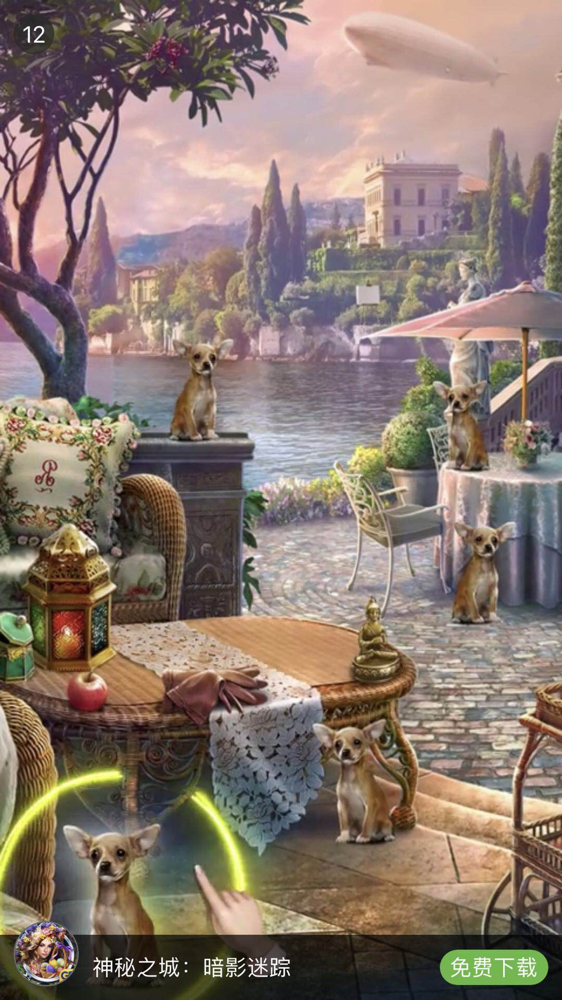
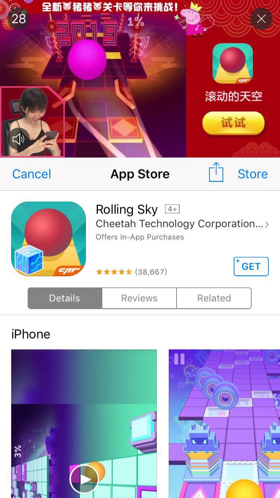

- [Mintegral Adx Doc](#mintegral-adx-doc)
  * [nURL and Impression Tracking URLs](#nURL-and-Impression-Tracking-URLs)
    + [About impression tracking URL](#About-impression-tracking-URL)
  * [nURL Macro Substitution](#nURL-Macro-Substitution)
  * [About Billing](#About-Billing)
  * [About COPPA](#About-COPPA)
  * [Supported Advertisement Types](#Supported-Advertisement-Types)
  * [About Video Template (optional)](#About-Video-Template-optional)
    + [What is Video Template](#What-is-Video-Template)
  * [How to Use Video Template](#How-to-Use-Video-Template)
    + [Video Template and Required Creatives](#Video-Template-and-Required-Creatives)
  * [About VAST](#About-VAST)
  * [Request-Demo](#Request-Demo)
    + [Rewarded Video & Interstitial Video Request](#rewarded-video--interstitial-video-request)
    + [Native image Request](#native-image-request)
    + [Native video Request](#native-video-request)
  * [Response Demo](#Response-Demo)
    + [Rewarded | Interstitial Video Reponse](#rewarded--interstitial-video-reponse)
    + [Native image Response](#native-image-response)
    + [Native video Response](#native-video-response)
  * [Request Specification](#Request-Specification)
    + [Object：BidRequest](#objectbidrequest)
    + [Object：Imp](#object-imp)
    + [Object: Banner](#object-banner)
    + [Object: Video](#object-video)
  * [Object: Native](#object-native)
  * [Object: NativeRequest](#object-nativerequest)
  * [Object: Asset](#object-asset)
  * [Object: Title](#object-title)
  * [Object: Img](#object-img)
  * [Object: Data](#object-data)
  * [Native Request Type Enum](#native-request-type-Enum)
  * [Object: App](#object-app)
  * [Object: Publisher](#object-publisher)
  * [Object: Device](#object-device)
  * [Object: Geo](#object-geo)
  * [Object: Regs](#object-regs)
- [返回接口说明](#返回接口说明)
  * [Object: BidResponse](#object-bidresponse)
  * [Object: Seatbid](#object-seatbid)
  * [Object: Bid](#object-bid)
  * [Object: Ext](#object-ext)
  * [Object: NativeResponse](#object-nativeresponse)
  * [Object: Asset](#object-asset-1)
    + [Object: Asset.Title](#object-assettitle)
    + [Object: Asset.Img](#object-assetimg)
    + [Object: Asset.Video](#object-assetvideo)
    + [Object: Asset.Data](#object-assetdata)
    + [Object: Asset.Link](#object-assetlink)
- [No bidding 说明](#no-bidding-说明)


# Mintegral Adx Doc

## nURL and Impression Tracking URLs

DSPs will provide the nURLs and the impression tracking URLs in the bidResponse, whereas impression tracking URLs are optional.
MTG ADX will call back both the nURL and the impression tracking URL when an Ad is displayed on the client device. 

### About impression tracking URL

To reduce variance in the impression statistic, it is suggested to provide an individual tracking URL for each Ad type and each DSP.

For different ad types, DSP should follow the rules below to submit impression tracking URLs.
1) Interactive ads and Banner: The impression tracking URL is provided in the filed **Bidresponse.Seatbid.Bid.Ext.Imptrakers**
2) Native image and Native video: The impression tracking URL is provided in the field **imptrakers** of the Native Ads protocol. 
3) Rewarded video and Interstitial video ad formats: The impression tracking URL is provided in the \<impression>tag of VAST.

## nURL Macro Substitution

MTG ADX support the following macro substitution.

| Name | Description | Note |
|---|---|---|
|${AUCTION_ID}     |	Bid Request ID  |	The request.id from MTG ADX to DSP |
|${AUCTION_BID_ID} | Bid Response ID	| The response BidResponse.BidID from DSP to MTG ADX |
|${AUCTION_IMP_ID} | Impression ID    |	The response Bid.ImpId from DSP|
|${AUCTION_SEAT_ID}| Seat ID          |	The response BidResponse.SeatBid.Seat from DSP|
|${AUCTION_AD_ID}	 | Advertisement ID | The Ad ID Bid.Adid|
|${AUCTION_PRICE}	 | Settlement Price |	Encrypted settlement price, for more details please refer to the settlement price decryption section|


## About Billing 

MTG ADX bills DSPs based on the callback times of the nURLs.

MTG ADX will guarantee **at most once** callback on the nURL each time an Ad is displayed；

Meanwhile, MTG ADX will also ensure the callback of the nURL will happen within a valid period after the demonstration of the Ad.

DSP can set the timeout of this period in the field Bidresponse.Seatbid.Bid.Exp.

## About COPPA

If the value of bidrequest.regs.coppa is 1, it means that this Ad flow is targeted at children under the age of 13, or a child-oriented App.

In this case, the DSP must guarantee the provided Ads are appropriate for children under the age of 13. 

Meanwhile, the DSP must ensure data collection, data usage and data tracking comply with the COPPA regulations.

## Supported Advertisement Types

MTG ADX supports the following types of advertisement：

* Rewarded Video
* Interstitial Video
* Native Video
* Native Image

## About Video Template (optional)

Rewarded video and Interstitial video support multiple video templates，DSP can compare and choose one or more of them to use. However, this is fully optional. 

### What is Video Template

Video templates are multiple predefined video playing modes, DSPs can choose the optimal template to serve ads.

MTG ADX supports the following video templates：

|Image|Description|
|---|----|
||V1 Video centered with black background|
||V2 Video centered with Gaussian Blur|
||V3 Video on top with info-card at bottom|
||V4 Video on top with storekit at bottom|
||V8 Video in the middle of two info-cards|


## How to Use Video Template

1. Request: If a DSP wants to use video template, MTG ADX will send in the bidrequest with the field bidrequest.imp.video.ext.videotemplate set, which is an array of objects and each object represents a type of video template.
The structure of a Video Template object:
**When video templates are in use, the width and height requirement of the video template object are applied, instead of the width and height requirement of the video object**

| Attribute	| Type	| Required | Description |
|---|---|---|---|
|id |	integer	|Yes	| Template id|
|name	 |String|	Yes| 	Template name|
|videow	 |integer| The videow/ videoh pair or the videoorientaion will be presented |	Width of the video player in device independent pixels (DIPS).|
|videoh	 |integer|	The videow/ videoh pair or the videoorientaion will be presented| Height of the video player in device independent pixels (DIPS).|
|videoorientation	 |integer|The videow/ videoh pair or the videoorientaion will be presented	|Orientation of video. Enumeration value is as below: 1="portrait",2="horizontal". 1 represents DSP can return video with a ratio of 16:9, 2 represents DSP can return video with a ratio of 16:9 or 9:16.|

2. Response: DSP returns the ID of the chosen video template, as well as the creative elements required for the video template.

  DSP should add a \<Template type="video"> tag under the \<Extension> tag in VAST, and provide the ID of the chosen vide template. 
  
  Assets except video, title and desc should be provided under \<Asset> tags.

  Please note that videos should always be provided as linear creative, and title should be provided in a \<Title> tag, and description in a \<description>tag.
  ```xml
<Extensions>
  <Extension>
      <Templates type="video" ></Templates>
      <Asset type="starrating" >4.5</Asset>
      <Asset type="CTA" >Install</Asset>
      <Asset type="icon" creativeType="image/jpeg">
        <![CDATA[http://cdn-adn.rayjump.com/cdn-adn/v2/dmp/18/12/25/00/13/5c2105bc9869e.jpg]]>
      </Asset>
  </Extension>
</Extensions>
  ```

### Video Template and Required Creatives

“/” Not Required

|id|	Name|	title |	Description | icon |CTA |	star rating |	bundle id |
|---|---|---|---|---|---|---|---|
|1|	V1 Video centered with black background	|/|	/|	/|	/|	/|	/|
|2|	V2 Video centered with Gaussian Blur	|/|	/|	/|	/|	/|	/|
|3|	V3 Video on top with info-card at bottom	|15 characters max | /	|w/h ratio of 1:1| 5 characters max (optional)|	optional | / |
|4|	V4 Video on top with storekit at bottom |/|/| 	/|	/|	/|	ios example: 907394059 |
|8|	V8 Video in the middle of two info-cards|	15 characters max|	30 characters max|	w/h ratio of 1:1|	5 characters max	| optional |/ |


## About VAST

VAST version is specified by Bidrequest.Imp.Video.Protocols. Currently MTG ADX supports VAST 3.0.
All links in VAST should be wrapped in CDATA.

## Request Demo

### Rewarded Video & Interstitial Video Request
```json
{
    "id": "fb570d84-0328-451f-9c19-f4cad4ed0e30",
    "app": {
        "id": "92762",
        "ver": "8.0.5",
        "bundle": "test.mtg.cn",
        "publisher": {
            "id": "12441"
        },
        "storeurl": "https://play.google.com/store/apps/details?id=test.mtg.cn"
    },
    "at": 2,
    "tmax": 2000,
    "imp": [
        {
            "id": "1",
            "video": {
                "mimes": [
                    "video/mp4"
                ],
                "maxduration": 30,
                "protocols": [
                    2
                ],
                "w": 1080,
                "h": 1920,
                "linearity": 1,
                "skip": 0,
                "battr": [
                    16
                ],
                "maxbitrate": 2000,
                "delivery": [
                    2
                ],
                "companionad": [
                    {
                        "w": 1080,
                        "h": 1920,
                        "id": "1",
                        "btype": [
                            1,
                            2,
                            4
                        ],
                        "battr": [

                        ],    
                        "pos": 7,
                        "mimes": [
                            "application/javascript"
                        ],
                        "ext": {
                            "orientation": 1
                        }
                    }
                ],
                "companiontype": [
                    2
                ],
                "ext": {
                    "orientation": 1,
                    "videotype": 1,
                    "videotemplate": [
                        {
                            "id": 1,
                            "name": "middle_black_screen",
                            "videow": 1080,
                            "videoh": 1920,
                            "videoorientation": 1
                        },
                        {
                            "id": 2,
                            "name": "middle_fur_screen",
                            "videow": 1080,
                            "videoh": 1920,
                            "videoorientation": 1
                        },
                        {
                            "id": 6,
                            "name": "stretch_screen",
                            "videow": 1080,
                            "videoh": 1920,
                            "videoorientation": 1
                        },
                        {
                            "id": 3,
                            "name": "above_video",
                            "videoorientation": 2
                        },
                        {
                            "id": 5,
                            "name": "image_video",
                            "videoorientation": 2
                        }
                    ],
                    "videoendtype": [
                        1
                    ],
                    "endcardonly": true
                }
            },
            "tagid": "21310",
            "bidfloor": 0.01,
            "bidfloorcur": "USD",
            "secure": 0
        }
    ],
    "device": {
        "ua": "Mozilla/5.0 (Linux; Android 6.0.1; SM-G610F Build/MMB29K) AppleWebKit/535.19 (KHTML, like Gecko) Chrome/18.0.1025.133 Mobile Safari/535.19",
        "geo": {
            "country": "IND",
            "city": "Goa"
        },
        "ip": "106.213.155.0",
        "devicetype": 4,
        "make": "samsung",
        "model": "sm-g610f",
        "os": "android",
        "osv": "6.0.1",
        "language": "zh",
        "carrier": "45201",
        "connectiontype": 2,
        "ifa": "eebb9c88-bbd3-49bc-87cc-cb6babdf1ea4",
        "didsha1": "1ad2308597ee8b54c21de2d15a095cb7b322db12",
        "didmd5": "69a975be6d1f9ce3604d99a2fe794ab0",
        "dpidsha1": "747417f2206148a3118d02f3adf20b5e4139baac",
        "dpidmd5": "fa1d3eb08a879de9a4cd9995a1aa91e1",
        "imei": "863183034027383",
        "android_id": "1111111111111111",
        "dnt": 0,
        "lmt": 0
    }
}
```

### Native image Request
```json
{
    "id": "5c7f8c1031f73b6b3ed5b7fx",
    "imp": [{
      "id": "1",
      "native": {
        "request": "{\"ver\":\"1.1\",\"assets\":[{\"id\":7,\"required\":1,\"img\":{\"type\":3,\"w\":1200,\"h\":627}},{\"id\":3,\"required\":1,\"title\":{\"len\":20}},{\"id\":4,\"required\":1,\"data\":{\"type\":2}}]}",
        "ver": "1.1"
    },
    "tagid": "14915",
    "bidfloor": 0.1,
    "bidfloorcur": "USD",
    "secure":1
    }],
    "app": {
      "id": "25259",
      "cat": ["IAB9", "IAB1"],
      "ver": "9.5.1",
      "bundle": "id443354861",
      "publisher": {
        "id": "5095"
      },
      "storeurl": "https://itunes.apple.com/cn/app/%E7%9B%B8%E6%9C%BA360-%E8%87%AA%E6%8B%8D%E8%BE%BE%E4%BA%BA%E5%BF%85%E5%A4%87%E7%9A%84%E7%BE%8E%E9%A2%9C%E7%A5%9E%E5%99%A8/id443354861?mt=8"
  },
  "device": {
      "ua": "Mozilla/5.0 (iPhone; CPU iPhone OS 12_1_4 like Mac OS X) AppleWebKit/605.1.15 (KHTML, like Gecko) Mobile/16D57",
      "geo": {
        "country": "THA",
        "city": "175249"
      },
      "dnt": 0,
      "ip": "223.207.218.75",
      "devicetype": 4,
      "make": "apple",
      "model": "iphone xr",
      "os": "ios",
      "osv": "12.1.4",
      "language": "th",
      "carrier": "52005",
      "connectiontype": 2,
      "ifa": "6273CA83-ACD0-4898-BC56-F143E53AC936"
    },
    "at": 2,
    "tmax": 2000
}
```

### Native video Request
```json
{
      "id": "Android_native_video",
      "imp": [
              {
                      "id": "1",
                      "native": {
                              "request": "{\"ver\":\"1.1\",\"assets\":[{\"id\":7,\"required\":1,\"img\":{\"type\":3,\"w\":1200,\"h\":627}},{\"id\":1,\"required\":1,\"img\":{\"type\":1,\"w\":300,\"h\":300}},{\"id\":3,\"required\":1,\"title\":{\"len\":20}},{\"id\":4,\"required\":1,\"data\":{\"type\":2}},{\"id\":5,\"required\":1,\"data\":{\"type\":3}},{\"id\":6,\"required\":1,\"data\":{\"type\":12}},{\"id\":2,\"required\":1,\"video\":{\"mimes\":[\"video/mp4\"],\"w\":0,\"h\":0,\"ext\":{\"orientation\":2}}}]}",
                              "ver": "1.1"
                      },
                      "tagid": "21307",
                      "bidfloor": 0.01,
                      "bidfloorcur": "USD",
                      "secure": 0,
                      "support_download": false,
                      "request_type": 7
                      
              }
      ],
      "app": {
              "id": "92762",
              "ver": "8.0.5",
              "bundle": "test.mtg.cn",
              "publisher": {
                      "id": "12441"
              },
              "storeurl": "https://play.google.com/store/apps/details?id=test.mtg.cn"
      },
      "device": {
              "ua": "Mozilla/5.0 (Linux; Android 6.0.1; SM-G610F Build/MMB29K) AppleWebKit/535.19 (KHTML, like Gecko) Chrome/18.0.1025.133 Mobile Safari/535.19",
              "geo": {
                      "country": "SGP",
                      "city": "2222"
              },
              "dnt": 0,
              "ip": "123.125.71.38",
              "devicetype": 4,
              "make": "samsung",
              "model": "sm-g610f",
              "os": "android",
              "osv": "6.0.1",
              "language": "en",
              "carrier": "45201",
              "connectiontype": 2,
              "ifa": "eebb9c88-bbd3-49bc-87cc-cb6babdf1ea4",
              "didsha1": "dec639f355b425e4d425e628eed8638244a93e6a",
              "didmd5": "bb75882f511f906d109f8831ec780ae7",
              "imei": "354124073790693"
      },
      "at": 2,
      "tmax": 2000
}
```

## Response Demo

### Rewarded | Interstitial Video Reponse
```json
{
  "id":"1b26b039-7c0d-4c8b-94b3-15cb60c27da1",
  "seatbid":[
      {
          "bid":[
              {
                  "id":"10004-1673e175-f942-4e6b-9985-2b9e2227375e",
                  "impid":"1",
                  "price":1153.4,
                  "adid":"512205",
                  "adm":"<?xml version=\"1.0\" encoding=\"UTF-8\"?><VAST version=\"2.0\"><Ad id=\"08f0ade0-0844-11e9-9857-0242e01c4a20\"><InLine><AdSystem>mobvista</AdSystem><AdTitle>cs_video3</AdTitle><Impression id=\"0\"><![CDATA[http://a.com/winloss/Imps?impId=32f9293]]></Impression><Creatives><Creative id=\"55\" sequence=\"1\"><Linear><Duration>00:00:27</Duration><TrackingEvents><Tracking event=\"start\"><![CDATA[start]]></Tracking><Tracking event=\"start\"><![CDATA[http://a.com/winloss/Clicks?crId168.16.7:6688;redir=1]]></Tracking><Tracking event=\"firstQuartile\"><![CDATA[firstQuartile]]></Tracking><Tracking event=\"firstQuartile\"><![CDATA[http://a.com/winloss/Clicks?crId=5.16.7:6688;redir=1]]></Tracking><Tracking event=\"midpoint\"><![CDATA[midpoint]]></Tracking><Tracking event=\"midpoint\"><![CDATA[http://a.com/winloss/Clicks?crId168.16.7:6688;redir=1]]></Tracking><Tracking event=\"thirdQuartile\"><![CDATA[thirdQuartile]]></Tracking><Tracking event=\"thirdQuartile\"><![CDATA[http://a.com/winloss/Clicks?crId=.168.16.7:6688;redir=1]]></Tracking><Tracking event=\"complete\"><![CDATA[complete]]></Tracking><Tracking event=\"complete\"><![CDATA[http://a.com/winloss/Clicks?crId=5:6688;redir=1]]></Tracking><Tracking event=\"mute\"><![CDATA[mute]]></Tracking><Tracking event=\"mute\"><![CDATA[http://a.com/winloss/Clicks?crId=68.16.7:6688;redir=1]]></Tracking><Tracking event=\"unmute\"><![CDATA[unmute]]></Tracking><Tracking event=\"unmute\"><![CDATA[http://a.com/winloss/Clicks?crId=55168.16.7:6688;redir=1]]></Tracking><Tracking event=\"pause\"><![CDATA[pause]]></Tracking><Tracking event=\"pause\"><![CDATA[http://a.com/winloss/Clicks?crId=55;sId=72.16.7:6688;redir=1]]></Tracking><Tracking event=\"fullscreen\"><![CDATA[fullscreen]]></Tracking><Tracking event=\"fullscreen\"><![CDATA[http://a.com/winloss/Clicks?crId.16.7:6688;redir=1]]></Tracking></TrackingEvents><VideoClicks><ClickThrough><![CDATA[http://a.com/winloss/Clicks?crId=55]]></ClickThrough></VideoClicks><MediaFiles><MediaFile delivery=\"progressive\" type=\"video/mp4\" bitrate=\"446\" width=\"720\" height=\"1280\" scalable=\"false\" apiFramework=\"NONE\"><![CDATA[http://a.com/creativeFiles/d/7/9F1DB6B6853412.mp4]]></MediaFile></MediaFiles></Linear></Creative></Creatives></InLine></Ad></VAST>",
                  "nurl":"http://a.com/n?price=${AUCTION_PRICE}",
                  "iurl":"http://b.com/4",
                  "cat":[
                      "IAB12-2"
                  ],
                  "qagmediarating":1,
                  "ext":{
                      "videoendtype":1,
                      "endcardonly":true
                  }
              }
          ]
      }
  ],
  "bidid":"10004-1673e175-f942-4e6b-9985-2b9e2227375e"
}
```

### Native image Response

```json
{
    "id": "1a48f7e5-2a31-4907-90db-dbe9dd5c0ad0",
    "seatbid": [{
      "bid": [{
        "id": "712107b0-0840-11e9-9857-0242e01c4a20",
        "impid": "1",
        "price": 2.3,
        "adid": "57",
        "adm": "{\"native\":{\"link\":{\"url\":\"http://a.com/winloss/Clicks\"},\"imptrackers\":[\"http://a.com/winloss/Imps?impId56\"],\"assets\":[{\"id\":7,\"img\":{\"url\":\"http://a.com/creativeFiles/e/8/92FB12A.jpg\",\"h\":627,\"w\":1200}},{\"id\":1,\"img\":{\"url\":\"http://a.com/creativeFiles/c/5/8EAF929C94AD494F8E2B56E84262A580.png\",\"h\":128,\"w\":128}},{\"id\":3,\"title\":{\"text\":\"Text\"}},{\"id\":4,\"data\":{\"value\":\"Description\"}},{\"id\":6,\"data\":{\"value\":\"Description\"}}]}}",
        "adomain": ["http://www.baidu.com"],
        "nurl": "http://a.com/ad0062",
        "iurl": "http://a.com/25F79ADE4F92E3B.mp4",
        "cid": "",
        "crid": "57",
        "cat": ["IAB3-1"],
        "qagmediarating": 1,
        "ext": {
          "videoendtype": 1,
          "endcardonly": true
        }
      }]
    }],
    "cur": "USD"
}
```

### Native video Response
```json
{
    "id": "01652509-dbd5-4ee7-aa63-56dc066cba1d",
    "seatbid": [{
      "bid": [{
        "id": "6c2ac6f0-0841-11e9-9857-0242e01c4a20",
        "impid": "1",
        "price": 2.5,
        "adid": "58",
        "adm": "<?xml version=\"1.0\" encoding=\"UTF-8\"?><VAST version=\"2.0\"><Ad id=\"08f0ade0-0844-11e9-9857-0242e01c4a20\"><InLine><AdSystem>mobvista</AdSystem><AdTitle>cs_video3</AdTitle><Impression id=\"0\"><![CDATA[http://a.com/winloss/Imps?impItimestamp=1545742391293]]></Impression><Creatives><Creative id=\"55\" sequence=\"1\"><Linear><Duration>00:00:27</Duration><TrackingEvents><Tracking event=\"start\"><![CDATA[start]]></Tracking><Tracking event=\"start\"><![CDATA[http://a.com/winloss/Clicks?crId=55;sI1]]></Tracking><Tracking event=\"firstQuartile\"><![CDATA[firstQuartile]]></Tracking><Tracking event=\"firstQuartile\"><![CDATA[http://a.com/winloss/Clicks?crId=;redir=1]]></Tracking><Tracking event=\"midpoint\"><![CDATA[midpoint]]></Tracking><Tracking event=\"midpoint\"><![CDATA[http://a.com/winloss/Clicks?crId=1]]></Tracking><Tracking event=\"thirdQuartile\"><![CDATA[thirdQuartile]]></Tracking><Tracking event=\"thirdQuartile\"><![CDATA[http://a.com/winloss/Clicks?t=1]]></Tracking><Tracking event=\"complete\"><![CDATA[complete]]></Tracking><Tracking event=\"complete\"><![CDATA[http://a.com/winloss/Clicks?crId=1]]></Tracking><Tracking event=\"mute\"><![CDATA[mute]]></Tracking><Tracking event=\"mute\"><![CDATA[http://a.com/winloss/Clicks]]></Tracking><Tracking event=\"unmute\"><![CDATA[unmute]]></Tracking><Tracking event=\"unmute\"><![CDATA[http://a.com/winloss/Clicks1]]></Tracking><Tracking event=\"pause\"><![CDATA[pause]]></Tracking><Tracking event=\"pause\"><![CDATA[http://a.com/winloss/Clicks?crId=55;sId=72;lId=1]]></Tracking><Tracking event=\"fullscreen\"><![CDATA[fullscreen]]></Tracking><Tracking event=\"fullscreen\"><![CDATA[http://a.com/winloss]]></Tracking></TrackingEvents><VideoClicks><ClickThrough><![CDATA[http://a.com/winloss/Clicks?crId=55]]></ClickThrough></VideoClicks><MediaFiles><MediaFile delivery=\"progressive\" type=\"video/mp4\" bitrate=\"446\" width=\"720\" height=\"1280\" scalable=\"false\" apiFramework=\"NONE\"><![CDATA[http://a.com/creativeFiles/d/7/9F1624F9DB6B6853412.mp4]]></MediaFile></MediaFiles></Linear></Creative></Creatives></InLine></Ad></VAST>",
        "adomain": ["http://www.baidu.com"],
        "nurl": "http://a.com/winloss/Wins?price=${AUCTION_PRICE}",
        "iurl": "http://a.com/creativeFiles/0/f/F0C177E4198E2BEAB0891.mp4",
        "cid": "",
        "crid": "58",
        "cat": ["IAB3-1"],
        "qagmediarating": 1,
        "ext": {
          "videoendtype": 1,
          "endcardonly": true
        }
      }]
    }],
    "cur": "USD"
}
```

## Request Specification

Mintegral’s RTB protocols are based on the IAB’s Open RTB API Specification Version 2.5 with extra attributes from Mintegral ADX. 

Standard attributes from IAB open RTB that are not supported by Mintegral ADX are ~~crossed out~~.

### Object：BidRequest

|  Attribute            | Type|           Required|   Description|
|---|---|---|---|
 | id |      string  | Yes| Unique ID of the bid request, provided by MTG ADX.|
 | imp| object array | Yes | An array of one or more impressionobjects, each impressionobject represents the impression offered. For details, pleaae refer to [Object：Imp](#object-imp)|
 | ~~site~~  |     object     |   No    |     site info|
 | app     | object     |   Yes      |   please refer to [Object App](#object-app)|
 | device  | object     |   Yes      |   please refer to [Object Device](#object-device)|
 | ~~user~~| object     |   No|    user info|
 | ~~test~~| integer    |    No|    test mode|
 | at      |   integer    |    Yes|  Auction type, where 1 = First Price, 2 = Second Price Plus.|
 | tmax    |   integer    |    No|    Maximum time in milliseconds the exchange allows for bids to be received including internet latency to avoid timeout. This value supersedes any a priori guidance from the exchange.|
 | ~~wseat~~|   string array|   No|    White list of buyer seats (e.g., advertisers, agencies) allowed to bid on this impression. IDs of seats and knowledge of the buyer’s customers to which they refer must be coordinated between bidders and the exchange a priori. At most, only one of wseat and bseat should be used in the same request. Omission of both implies no seat restrictions.|
 | ~~bseat~~|    string array|   No|    Block list of buyer seats (e.g., advertisers, agencies) restricted from bidding on this impression. IDs of seats and knowledge of the buyer’s customers to which they refer must be coordinated between bidders and the exchange a priori. At most, only one of wseat and bseat should be used in the same request. Omission of both implies no seat restrictions.|
 | ~~allimps~~|   integer     |   No|     Flag to indicate if Exchange can verify that the impressions offered represent all of the impressions available in context (e.g., all on the web page, all video spots such as pre/mid/post roll) to support road-blocking. 0 = no or unknown, 1 = yes, the impressions offered represent all that are available.|
 | ~~cur~~    |   string array|   No|   Array of allowed currencies for bids on this bid request using. ISO-4217 alpha codes. Recommended only if the exchange accepts multiple currencies.|
 | ~~wlang~~  |   string array|   No|   White list of languages for creatives using ISO-639-1-alpha-2. Omission implies no specific restrictions, but buyers would be advised to consider language attribute in the Device and/or Content objects if available.|
 | bcat    | string array  | No    | Blocked advertiser categories using the IAB content categories. Refer to Appendix-Content Categories.|
 | badv    |  string array|  No|   Block list of advertisers by their domains (e.g., “ford.com”).|
 | bapp    |  string array|  No| Block list of applications by their platform\-specific exchange\-independent application identifiers. For example, on Android com.amazon.mShop; on IOS：*907394059* |
 | ~~source~~|  object|   No| A Sorce object (Section 3.2.2) that provides data about the inventory source and which entity makes the final decision.|
 | regs    | object  |  No| A Regs object that specifies any industry, legal, or governmental regulations in force for this request. Refer to [Object Regs](#object-regs) |

### Object: Imp

| Attribute	| Type |	Required	| Description |
| ---|---|---|---|
|id	|string|	Yes| A unique identifier for this impression within the context of the bid request; On Mintegral ADX, one request only sells one impression.|
|~~metric~~	|object array |	No|	An array of Metric object|
|banner	|object Banner	 |Banner required|	Refer to [Object Banner](#object-banner)|
|video	|object	Video |Video required|	Refer to [Object Video](#object-video)|
|audio	|object	|Audio required|	Object Audio|
|native	|object Native	|Native required|	Refer to [Object Native](#object-native)|
|~~pmp~~	|object	|No|	A Pmp object containing any private marketplace deals in effect for this impression.|
|~~displaymanager~~	|string|	No|	Name of ad mediation partner, SDK technology, or player responsible for rendering ad (typically video or mobile). Used by some ad servers to customize ad code by partner. Recommended for video and/or apps.|
|~~displaymanagerver~~	|string	|No|	Version of ad mediation partner, SDK technology, or player responsible for rendering ad (typically video or mobile). Used by some ad servers to customize ad code by partner. Recommended for video and/or apps.|
|instl	|integer	|No|	1 = the ad is interstitial or full screen, 0 = not interstitial. default 0.|
|tagid	|string	|Yes|Identifier for specific ad placement or ad tag that was used to initiate the auction. This can be useful for debugging of any issues, or for optimization by the buyer.|
|bidfloor|	float	|Yes|Minimum bid for this impression expressed in CPM. default 0.|
|bidfloorcur|	string	|Yes|Currency specified using ISO-4217 alpha codes. This may be different from bid currency returned by bidder if this is allowed by the exchange. default USD|
|secure|	integer	|Yes|	Flag to indicate if the impression requires secure HTTPS URL creative assets and markup, where 0 = non-secure, 1 = secure.|
|~~iframebuster~~| string array | No|	Array of exchange\-specific names of supported iframe busters.|
|~~exp~~|	integer	|No|	Advisory as to the number of seconds that may elapse between the auction and the actual impression.|
| ext	|object|	No|	Refer to Object：ext(imp)|

## Object:Ext(imp)
| Attribute	| Type |	Required	| Description |
|---|---|---|---|
|deeplink | int | No | is the request supports deeplink |

### Object: Banner

| Attribute	| Type |	Required	| Description |
| ---|---|---|---|
|format	|object array|	No|	Array of format objects representing the banner sizes permitted.|
|w	|integer|	No|	Exact width in device independent pixels (DIPS); recommended if no format objects are specified.|
|h	|integer|	No|	Exact height in device independent pixels (DIPS); recommended if no format objects are specified.|
|id	|string	|Yes| Unique identifier for this banner object. Used when an Ad contains Banner and Video|
|btype|	integer array	|No|	Blocked banner ad types. Refer to Banner Ad Types|
|battr|	integer array	|No|	Blocked creative attributes. Refer to Creative Attributes|
|pos|	integer|	No|	Ad position on screen. Refer to Ad Position|
|mimes|	string array|	Yes|	Content MIME types supported. Popular MIME types may include "application/x-shockwave-flash", "image/jpg", and "image/gif".|
|~~topfram~~|	integer	|No| Indicates if the banner is in the top frame as opposed to an iframe, where 0 = no, 1 = yes.|
|~~expdir~~|	integer array	|No|	Directions in which the banner may expand. Refer to List Expandable Direction|
|api|	integer array	|No|	List of supported API frameworks for this impression. Refer to List API Frameworks If an API is not explicitly listed, it is assumed not to be supported.|
|~~vcm~~|	integer	|No|	Relevant only for Banner objects used with a Video object in an array of companion ads. Indicates the companion banner rendering mode relative to the associated video, where 0 = concurrent, 1 = end-card.|

### Object: Video

| Attribute	| Type |	Required	| Description |
|---|---|---|---|
|mimes|	string array|	Yes| Supported mine-type, including but not limited to "video/mp4".|
|minduration	|integer	|No|	Minimum video ad duration in seconds.|
|maxduration	|integer	|No|	Maximum video ad duration in seconds.|
|protocols	|integer array	|No|	Array of supported video protocols. Refer to List Protocols. |
|w|	integer	|Yes|Width of the video player in device independent pixels (DIPS).|
|h|	integer	|Yes|Height of the video player in device independent pixels (DIPS).|
|~~startdelay~~	|integer	|Yes|Indicates the start delay in seconds for pre-roll, mid-roll, or post-roll ad placements. Refer to List Start Delay for additional generic values.|
|~~placement~~	|integer	|Yes| Placement type for the impression. Refer to List Placement Types|
|linearity	|integer	|Yes|Indicates if the impression must be linear or not. 1 = linear, 2 = nonlinear.|
|skip	|integer	|Yes|Indicates if the player will allow the video to be skipped, where 0 = no, 1 = yes.|
|~~skipmin~~|	integer	|Yes|Videos of total duration greater than this number of seconds can be skippable; only applicable if the ad is skippable.|
|~~skipafter~~	|integer	|Yes|Number of seconds a video must play before skipping is enabled; Only applicable if the ad is skippable.|
|sequence	|integer	|Yes|If multiple ad impressions are offered in the same bid request, the sequence number will allow for the coordinated delivery of multiple creatives.|
|battr	|integer array	|Yes|Blocked creative attributes. Refer to List Creative Attributes|
|~~maxextended~~	|integer|	No|	Maximum extended ad duration if extension is allowed. If blank or 0, extension is not allowed. If -1, extension is allowed, and there is no time limit imposed. If greater than 0, then the value represents the number of seconds of extended play supported beyond the maxduration value.|
|minbitrate	|integer	|Yes|Minimum bit rate in Kbps. No limit if not provided.|
|maxbitrate	|integer	|Yes|Maximum bit rate in Kbps. No limit if not provided.|
|~~boxingallowed~~	|integer|	Yes|Indicates if letter-boxing of 4:3 content into a 16:9 window is allowed, where 0 = no, 1 = yes.|
|playbackmethod	|integer array	|No| Playback methods that may be in use. If none are specified, any method may be used. 1 = auto play with sound, 2 = auto play silently, 3 = click to play.|
|~~playbackend~~	|integer	|No|The event that causes playback to end.|
|delivery	|integer array	|No|	Supported delivery methods, 1 = streaming, 2 = progressive. If none specified, assume all are supported.|
|~~pos~~	|integer|	No|	Ad position on screen. Refer to List Ad Position|
|companionad	|object array	|No|	Array of Banner objects if companion ads are available.|
|api	|integer array|	No|	List of supported API frameworks for this impression. Refer to List API Frameworks. If an API is not explicitly listed, it is assumed not to be supported.|
|companiontype	|integer array	|No|	Supported VAST companion ad types. Recommended if companion Banner objects are included via the companionad array. If one of these banners will be rendered as an end-card, this can be specified using the vcm attribute with the particular banner. Refer to List Companion Types|
|ext	|object|	No|	Refer to [Object：ext](#object-ext)|

## Object:Ext
| Attribute	| Type |	Required	| Description |
|---|---|---|---|
|is_rewarded | bool | No | is the video request is rewarded |

## Object: Native

| Attribute	| Type |	Required	| Description |
|---|---|---|---|
| request | string | Yes|  Refer to [NativeRequest](#object-nativerequest)
|ver |                 string        |  No        | 	Version of the Dynamic Native Ads API to which request complies;|
|api |     integer array  | No|       List of supported API frameworks for this impression. Refer to[API Frameworks](appendix.md#api-frameworks) |
|battr    |integer array   |No|        Blocked creative attributes. Refer to[Creative Attributes](appendix.md#creative-attributes)|

## Object: NativeRequest

| Attribute	| Type |	Required	| Description |
|---|---|---|---|
|  ver                  |string         |No|         Native Markup version, default value 1.1|
|  ~~context~~          |integer        |No|         The context in which the ad appears.|
|  ~~contextsubtype~~   |integer        |No|         A more detailed context in which the ad appears.|
|  ~~plcmttype~~        |integer        |No|         The design/format/layout of the ad unit being offered.|
|  ~~plcmtcnt~~         |integer        |No|         The number of identical placements in this Layout.|
|  ~~seq~~              |integer        |No|         Placement sequences.|
|  assets    |object array   |Yes| An array of [Object Asset](#object-asset), Any bid response must comply with the array of elements expressed in the bid request.|

## Object: Asset

| Attribute	| Type |	Required	| Description |
|---|---|---|---|
|  id                  |integer   |Yes|         Unique asset ID.|
|  required            |integer   |Yes| Set to 1 if asset is required (exchange will not accept a bid without it), 0 for not required.|
|  title    |object Title   |No|         Refer to [title object](#object-title)|
|  img      |object Img   |No|         Refer to [img object](#object-img)|
|  video   |object Video   |No|         Refer to [video object](#object-video)|
|  data    |object Data   |No|         Data object for brand name, description, ratings, prices etc. Refer to [data object](#object-data)|

## Object: Title

| Attribute	| Type |	Required	| Description |
|---|---|---|---|
|len | integer | Yes| Maximum length of the title.|

## Object: Img

| Attribute | Type             | Required |Description |
|----------|------------------|-----------------------|---------------------|
| type     | integer          | No | Type of the image: 1-icon；2-logo(brand)；3-large picture|
| w        | integer          | No | Exact width in device independent pixels (DIPS);                          |
| wmin | integer          | No | Minimum width in device independent pixels (DIPS).                       |
| h        | integer          | Exact height in device independent pixels (DIPS)|                                                    |
| hmin | integer          | No | Minimum height in device independent pixels (DIPS).                          |
| mimes    | array of strings | No | Content MIME types supported. Popular MIME types may include “application/javascript”, “image/jpg”, “image/gif”.                        |

## Object: Data

| Attribute | Type    | Required | Description                                                                                          |
|----------|---------|----------|---------------------------------------|
| type     | integer | Yes       | Type of the data object. Refer to [Native Request Type Enum](#native-request-type-Enum) |
| len      | integer | No       | Maximum length of the text in the element’s response.|

## Native Request Type Enum

| Type ID | Name       | Description | Required Type             |
|---------|------------|--------------------------------------------------------------|----------------------------|
| 1       | ~~sponsored~~  | Sponsor Name is required.                           | text                       |
| 2       | desc       | Descriptions are required                     | text                       |
| 3       | rating     | Rating of the product. For example an app's rating in app store from 0-5 |number formatted as string |
| 4       | likes      |                              | number formatted as string |
| 5       | ~~downloads~~  | 表示返回需要带上产品的下载/安装数量；                        | number formatted as string |
| 6       | price      | 表示返回需要带上产品的价格，值需要带上货币符号；             | number formatted as string |
| 7       | ~~saleprice~~  | 表示返回需要带上产品的促销价格，值需要带上货币符号；         | number formatted as string |
| 8       |~~phone~~      | 表示返回需要带上电话号码；                                   | formatted string           |
| 9       | ~~address~~    | 表示返回需要带上地址；                                       | text                       |
| 10      | ~~desc2~~      | 表示返回需要带上对推广产品或服务的额外Description；                 | text                       |
| 11      | ~~displayurl~~ | 表示文字广告的展示 url；                                     | text                       |
| 12      | ctatext    | 表示 CTA 按钮文字；                                          | text                       |

## Object: App

| Name      | Type         | Required | Description                                                            |
|---------------|--------------|----------|------------|
| id            | string;      | No | Exchange-specific app ID.                                     |
| name          | string       | No | App name                                      |
| bundle        | string       | No | A platform-specific application identifier intended to be unique to the app and independent of the exchange. On Android, this should be a bundle or package name (e.g., com.foo.mygame). On iOS, it is typically a numeric ID.|
| domain        | string       | No | Domain of the app (e.g., mygame.foo.com).                          |
| storeurl      | string       | No | App store URL for an installed app; for IQG 2.1 compliance.    |
| cat           | string array | No | Array of IAB content categories of the app. Refer to [Content Categories](appendix.md#content-categories).                   |
| ~~sectioncat~~    | string array | No | Array of IAB content categories that describe the current section of the app.Refer to [Content Categories](appendix.md#content-categories).    |
| ~~pagecat~~       | string array | No | Array of IAB content categories that describe the current page or view of the app. Refer to [Content Categories](appendix.md#content-categories).       |
| ver           | string       | No | APP version                                                 |
| ~~privacypolicy~~ | integer      | No | Indicates if the app has a privacy policy, where 0 = no, 1 = yes.                    |
| paid          | integer      | No | 0 = app is free, 1 = the app is a paid version.                             |
| publisher     | object Publisher     | No | Refer to Refer to [Object Publisher](#object-publisher).  |
| content       | object       | No | Details about the Content within the app.                            |
| keywords      | string       | No | Comma separated list of keywords about the app.             |

## Object: Publisher
| Attribute | Type         | Required | Description                                          |
|-----------|--------------|----------|------------------------------------------------------|
| id        | string       | No | Exchange-specific publisher ID.                          |
| ~~name~~      | string       | No | Publisher name.                                      |
| cat       | string array | No | Array of IAB content categories that describe the publisher. Refer to [Content Categories](appendix.md#content-categories).      |
| ~~domain~~    | string       | No | Highest level domain of the publisher (e.g., “publisher.com”).         |

## Object: Device

| Attribute       | Type    | Required | Description                                                                                                                                                              |
|----------------|---------|----------|-------------------------------------------------------------------------------------------------------------------------------------------------------------------|
| ua             | string  | No | Browser user agent string. |
| geo            | object  | No | Location of the device assumed to be the user’s current location defined by a [Geo object](#object-geo).
| dnt            | integer | No | Standard “Do Not Track” flag as set in the header by the browser, where 0 = tracking is unrestricted, 1 = do not track. Please note that this attribute has changed with regard to open RTB 2.4                |
| lmt            | integer | No | “Limit Ad Tracking” signal commercially endorsed (e.g., iOS, Android), where 0 = tracking is unrestricted, 1 = tracking must be limited per commercial guidelines.  Please note that this attribute has changed with regard to open RTB 2.4 |
| ip             | string  | Yes | IPv4 address closest to device.                                                                                                                |
| ~~ipv6~~           | string  | No | IP address closest to device as IPv6.                                                                                                                                |
| devicetype     | integer | Yes | The general type of device. Please refer to [Device Type](appendix.md#device-type)     |
| make           | string  | Yes | Device make (e.g., “Apple”, "unknown").                                                                                                |
| model          | string  | Yes | Device model. 1)On android , obtained from the system interface android.os.Build.MODEL; 2) On ios, obtained from system API , e.g.,  “iPhone5”, "iPhone6s", "iPhone 6s Plus".|
| os             | string  | Yes |   Device operating system (e.g., “iOS”, "unknown").                                                                                       |
| osv            | string  | Yes | Device operating system version (e.g., “3.1.2”). |
| hwv            | string  | No | Hardware version of the device (e.g., “5S” for iPhone 5S).                                                                |
| h              | integer | No | Physical height of the screen in pixels.                                                                      |
| w              | integer | No | Physical width of the screen in pixels.                                                                   |
| ~~ppi~~            | integer | No | Screen size as pixels per linear inch.                                                                    |
|~~pxratio~~        | float   | No | The ratio of physical pixels to device independent pixels.                                                    |
| js             | integer | No | Support for JavaScript, where 0 = no, 1 = yes.                                                       |
| ~~geofetch~~       | integer | No | Indicates if the geolocation API will be available to JavaScript code running in the banner, where 0 = no, 1 = yes.|
| ~~flashver~~       | string  | No | Version of Flash supported by the browser.                                                                                   |
| language       | string  | Yes | Browser language using ISO-639-1-alpha-2. "unknown" for unknown.                                                               |
| carrier        | string  | Yes | Mobile carrier as the concatenated MCC-MNC code (e.g., “310005” identifies Verizon Wireless CDMA in the USA). "unknown" for unknown.  |
| ~~mccmnc~~         | string  | No | Mobile carrier as the concatenated MCC-MNC code (e.g., “310-005” identifies Verizon Wireless CDMA in the USA).|
| connectiontype | integer | Yes | Network connection type. Refer to [Appendix Connection Type](appendix.md#connection-type)  |
| ifa            | string  | No | ID sanctioned for advertiser use in the clear.(i.e., not hashed). For IOS, this attribute shoube the idfa, and it is a required attribute. For Android, this attribute should be the gaid, it is only required for developers outside mainland China.|
| imei           | string  | No | Hardware device ID,IMEI                                                                                            |
| android_id     | string  | No | Platform device ID,Android ID                                                                                         |
| oaid     | string  | No | Platform device ID, OAID                                                                                         |
| didsha1        | string  |          | Hardware device ID (e.g., IMEI); hashed via SHA1.                                                                 |
| didmd5         | string  |          | Hardware device ID (e.g., IMEI); hashed via MD5.                                                        |
| dpidsha1       | string  |          | Platform device ID (e.g., Android ID); hashed via SHA1.                                                           |
| dpidmd5        | string  |          | Platform device ID (e.g., Android ID); hashed via MD5.                                            |

## Object: Geo

| Attribute      | Type    | Required | Description                                                                                                                                                                                                               |
|---------------|---------|----------|--------------------------------------------------------------------------------------------------------------------------------------------------------------------------------------------------------------------|
| lat           | float   | No | Latitude from -90.0 to +90.0, where negative is south.                        |
| lon           | float   | No | Longitude from -180.0 to +180.0, where negative is west.         |
| type          | integer | No | Source of location data;where 1= GPS,2= IP address,3= User provided.                                      |
| ~~accuracy~~      | integer | No | Estimated location accuracy in meters; recommended when lat/lon are specified and derived from a device’s location services (i.e., type = 1). Note that this is the accuracy as reported from the device. Consult OS specific documentation (e.g., Android, iOS) for exact interpretation.      |
| ~~lastfix~~       | integer | No | Number of seconds since this geolocation fix was established. Note that devices may cache location data across multiple fetches. Ideally, this value should be from the time the actual fix was taken. |
| ~~ipservice~~    | integer | No | Service or provider used to determine geolocation from IP address if applicable (i.e., type = 2).                 |
| country       | string  | No | Country code using ISO-3166-1-alpha-3.  |
| region        | string  | No | Region code using ISO-3166-2; 2-letter state code if USA.   |
|~~regionfips10~~ | string  | No | Region of a country using FIPS 10-4 notation. While OpenRTB supports this 
attribute, it has been withdrawn by NIST in 2008.    |
| metro         | string  | No | [Google metro code](http://code.google.com/apis/adwords/docs/appendix/metrocodes.html); similar to but not exactly Nielsen DMAs. |
| city          | string  | No | [City using United Nations Code for Trade & Transport Locations](http://www.unece.org/cefact/locode/service/location.htm).|
| zip           | string  | No | Zip or postal code.|
|~~utcoffse~~     | integer | No | Local time as the number +/- of minutes from UTC.|

## Object: Regs

| Attribute | Type    | Required | Description                                                                                                                                  |
|----------|---------|----------|---------------------------------|
| coppa    | integer | No | Flag indicating if this request is subject to the COPPA regulations established by the USA FTC, where 0 = no, 1 = yes. |

# Response Specification

Mintegral’s RTB protocols are based on the IAB’s Open RTB API Specification Version 2.5 with some extra attributes.
Attributes of the IAB’s specification that are not supported by Mintegral’s ADX are ~~~crossed out~~~.

## Object: BidResponse
| Attribute | Type         | Required | Description                                                      |
|----------|--------------|----------|-----------------------------------------------------------|
| id       | string;      | Yes | ID of the bid request to which this is a response.|
| seatbid  | object array | Yes | Array of seatbid objects; 1+ required if a bid is to be made. |
| bidid    | string       | No | Bidder generated response ID to assist with logging/tracking.  |
| cur      | string;      | No | Bid currency using ISO-4217 alpha codes.Default USD  |
| nbr      | integer      | No | Reason for not bidding.   |

## Object: Seatbid

| Attribute | Type         | Required | Description                                                                                                   |
|----------|--------------|----------|--------------------------------------------------------------------------------------------------------|
| bid      | object array | Yes | Array of 1+ [Bid objects](#object-bid) each related to an impression. Multiple bids can relate to the same impression.  |
| seat     | string       | No | ID of the buyer seat (e.g., advertiser, agency) on whose behalf this bid is made.              |
| group    | integer      | No | 0 = impressions can be won individually; 1 = impressions must be won or lost as a group. Default 0;|

## Object: Bid
| Attribute       | Type          | Required             | Description                                                                                                                                                      |
|----------------|---------------|----------------------|-----------------------------------------------------------------------------------------------------------------------------------------------------------|
| id             | string        | Yes | Bidder generated bid ID to assist with logging/tracking.|
| impid          | string        | Yes | ID of the Imp object in the related bid request.                         |
| price          | float         | Yes | Bid price expressed as CPM although the actual transaction is for a unit impression only.  |
| nurl           | string        | Yes | Win notice URL called by the exchange if the bid wins. MTG Adx will call this URL when the ad is successfully demonstrated. |
| burl           | string        | No | Billing notice URL called by the exchange when a winning bid becomes billable based 
on exchange-specific business policy.|
| lurl           | string        | No | Loss notice URL called by the exchange when a bid is known to have been lost.                                                                                            |
| adm            | string        | Yes | 广告素材标记；Native广告形式返回native response； 视频广告形式返回VAST XML;Banner广告形式返回xhtml；                                                      |
| adid           | string        | No | ID of a preloaded ad to be served if the bid wins.                        |
| adomain        | string array  | Yes | Advertiser domain for block list checking (e.g., “ford.com”).     |
| bundle         | string        | Yes（For app-install ad） | A platform-specific application identifier intended to be unique to the app and independent. On Android, this should be a bundle or package name (e.g., com.foo.mygame). On iOS, it is a numeric ID(e.g.,907394059).   |
| iurl           | string        | No | URL without cache-busting to an image that is representative of the content of the campaign 
for ad quality/safety checking.                           |
| cid            | string        | No | Campaign ID to assist with ad quality checking; the collection of creatives for which iurl 
should be representative    |
| crid           | string        | No | Creative ID to assist with ad quality checking.                                                                      |
| tactic         | string        | No | Tactic ID to enable buyers to label bids for reporting to the exchange the tactic through which their bid was submitted.  |
| cat            | string array  | Yes | IAB content categories of the creative. Refer to Appendix [Content Categories](appendix.md#content-categories)     |
| attr           | integer array | No | Set of attributes describing the creative. Refer to Appendix [Creative Attributes](appendix.md#creative-attributes)  |
| api            | integer       | No | API required by the markup if applicable. Refer to Appendix [API Frameworks](appendix.md#api-frameworks)|
| protocols      | integer       | No | Video response protocol of the markup if applicable. Refer to Appendix [Protocols](appendix.md#protocols)  |
| qagmediarating | integer       | Yes | Creative media rating per IQG guidelines. Refer to Appendix [IQG Media Ratings](appendix.md#iqg-media-ratings) |
| language       | string        | No | Language of the creative using ISO-639-1-alpha-2.  |
| dealid         | string        | No | Reference to the deal.id from the bid request if this bid pertains to a private marketplace direct deal. |
| w              | integer       | No | Width of the creative in device independent pixels (DIPS). |
| h              | integer       | No | Height of the creative in device independent pixels (DIPS).  |
| wratio         | integer       | No | Relative width of the creative when expressing size as a ratio.      |
| hratio         | integer       | No | Relative height of the creative when expressing size as a ratio.                  |
| exp            | integer       | No | Advisory as to the number of seconds the bidder is willing to wait between the auction and the actual impression. Default value 3600.|
| ext            | object ext       | No | Please refer to [Object Ext](#object-ext)  |

## Object: Ext

| Attribute    | Type             | Required | Description                                                     |
|-------------|------------------|----------|----------------------------------------------------------|
| imptrackers | string array | No | Impression tracking urls for banner and interative ads ad type. |
| deeplink | string  | No | deeplink url in response |
| deeplinkfallbackurl | string  | No | deeplink fallback url |

## Object: NativeResponse

| Attribute    | Type             | Required | Description                                                                                                                               |
|-------------|------------------|----------|------------------------------------------------------------------------------------------------------------------------------------|
| ver         | string           | No | Version of the Native Markup version in use.  |
| assets      | array of objects | Yes | List of native ad’s assets.Refer to [Assets Object](#object-asset)                               |
| link        | object           | Yes | This is default [Link Object](#object-assetlink) for the ad.Refer to link object.Note that we don't support separate 
click links for the creative.  |
| imptrackers | strings array    | Yes | Array of impression tracking URLs. Mintegral ADX will callback on these URLs when the ad is demonstrated successfully on the client. Please note that we do not support creative's default impression pixel tracking； |
| jstracker   | string           | No | Optional JavaScript impression tracker.|

## Object: Asset
| 参数     | Type    | Required                            | Description                                                          |
|----------|---------|-------------------------------------|---------------------------------------------------------------|
| id       | integer | Yes | Unique asset ID, assigned by exchange, must match one of the asset IDs in request.|
| required | integer | No | Whether the asset is complusory or not；Must matched with the reuqired attribute of the asset object within the bid request. |
| title    | object  | Required if the asset is required. | Pleaser refer to [Object Title](#object-assettitle)                             |
| img      | object  | Required if the asset is required. | Pleaser refer to [Object Img](#object-assetimg)                               |
| video    | object  | Required if the asset is required. | Pleaser refer to [Object Video](#object-assetvideo)                             |
| data     | object  | Required if the asset is required. | Pleaser refer to [Object Data](#object-assetdata)                          |
| link     | object  | Yes | Please refer to [Object Link](#object-assetlink)                                       |

### Object: Asset.Title

| Attribute | Type   | Required | Description       |
|----------|--------|----------|------------|
| text     | String | Yes | The title's content. |

 ### Object: Asset.Img
 
| Attribute | Type    | Required | Description                   |
|----------|---------|----------|------------------------|
| url      | string  | Yes | Url of the image.   |
| w        | integer | Yes | Width of the image in pixels. |
| h        | integer | Yes | Height of the image in pixels. | 

### Object: Asset.Video

| Attribute | Type   | Required | Description       |
|----------|--------|----------|------------|
| vasttag     | string | No | Video's vast xml.|

### Object: Asset.Data 

| Attribute | Type   | Required | Description       |
|----------|--------|----------|------------|
| label     | string | No | The label name for the data. Please  若传则严格按照 Data type 表的 name 传值|
| value     | string | Yes | The data's content value. 根据具体每个 data type 的要求返回值|

### Object: Asset.Link

| Attribute      | Type             | Required | Description                   |
|---------------|------------------|----------|------------------------|
| url           | string           | Yes | URL of the clickable link.     |
| clicktrackers | array of strings | No | List of third-party tracker URLs to be callback on click of the URL. |
| fallback      | string           | No | Fallback URL for deeplink.       |


# No bidding

If DSP does not want to bid, DSP should notify MTG ADX with a object containing a request ID and a nbr;
nbr is the not-to-bid reason. Please refer to [Appendix No-Bid Reason Codese](appendix.md#no-bid-reason-code)

